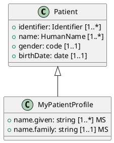

# MAKI - Modular Authoring Kit for Implementation guides

**Comprehensive Technical Plan for Next-Generation FSH Tooling Suite in Rust**

---

## 🍣 Executive Summary

**MAKI** is a complete SUSHI replacement written in Rust that aims to be 10-100x faster while maintaining 100% backward compatibility. It will provide:

- **Unified CLI experience**: One binary with `build`, `lint`, `format`, `test`, and `package` commands, plus project scaffolding
- **Complete SUSHI functionality**: FSH parsing, FHIR compilation, IG generation, and IG Publisher hand-off
- **Enhanced linting & formatting**: 50+ rules with excellent error messages, autofixes, formatter tuned to spec grammar, and guidance from FSH School courses
- **Advanced tooling**: LSP (IDE support), testing framework, documentation generator, migration tools
- **Drop-in compatibility**: Uses sushi-config.yaml, reads legacy SUSHI projects, generates same outputs
- **Superior performance**: Leverages Rust's speed and parallelization, shares caches via the canonical manager
- **Modern developer experience**: Rust-quality error messages, real-time diagnostics, actionable fix-its

---

## 🖥️ CLI Interface

### SUSHI-Compatible Commands (100% Backward Compatibility)

MAKI provides complete command-line compatibility with SUSHI, ensuring drop-in replacement:

```bash
# Main build command (SUSHI default - compiles FSH to FHIR + generates IG)
maki build [path] [options]
maki [path] [options]              # Shorthand (defaults to build)

# Project initialization (creates new FSH project with templates)
maki init [name] [options]

# Dependency management (updates package versions in sushi-config.yaml)
maki update-dependencies [path] [options]
```

**All SUSHI Flags Supported:**

| Flag | Description | Default |
|------|-------------|---------|
| `-l, --log-level <level>` | Logging verbosity: error/warn/info/debug | `info` |
| `-o, --out <path>` | Output directory for generated resources | `fsh-generated` |
| `-p, --preprocessed` | Output preprocessed FSH to `_preprocessed/` | `false` |
| `-r, --require-latest` | Exit with error if not latest MAKI version | `false` |
| `-s, --snapshot` | Generate StructureDefinition snapshots | `false` |
| `-c, --config <key:value>` | Override config elements at runtime | (none) |
| `-v, --version` | Print MAKI version and FSH spec version | N/A |
| `-h, --help` | Display help for command | N/A |

**Runtime Configuration Overrides (`--config`):**
```bash
# Override version and status at build time
maki build --config version:2.0.0 --config status:active

# Supported override keys:
# - version, status, releaselabel (IG metadata)
```

**Exit Codes (SUSHI-compatible):**
- `0` - Success (no errors)
- `1` - Fatal error (invalid config, unsupported FHIR version, missing dependencies)
- `N` - Number of FSH compilation errors encountered (for CI/CD)

---

### MAKI-Specific Commands (Enhanced Features)

Beyond SUSHI compatibility, MAKI provides powerful additional commands:

```bash
# === LINTING (NEW) ===
maki lint [path] [options]
  --fix                    # Apply safe autofixes
  --fix-unsafe             # Apply all autofixes (including semantic changes)
  --format <type>          # Output format: human|json|sarif|github
  --filter <pattern>       # Filter rules by name/category
  --config <path>          # Custom lint configuration file

# === FORMATTING (NEW) ===
maki format [path] [options]
  --check                  # Check formatting without modifying (CI mode)
  --indent <size>          # Indent size (default: 2)
  --line-width <width>     # Maximum line width (default: 120)
  --align                  # Align rule assignments

# === TESTING (NEW) ===
maki test [options]
  --watch                  # Watch mode (re-run on file changes)
  --coverage               # Generate coverage report
  --filter <pattern>       # Run tests matching pattern

# === DOCUMENTATION GENERATION (NEW) ===
maki docs [options]
  --out <path>             # Output directory (default: docs/)
  --format <type>          # Output format: markdown|html
  --include-diagrams       # Generate PlantUML diagrams

# === LANGUAGE SERVER (NEW) ===
maki lsp
  # Starts LSP server for IDE integration (VS Code, etc.)

# === PACKAGE MANAGEMENT (NEW - Enhanced over SUSHI) ===
maki packages <subcommand>
  install <pkg[@version]>  # Install FHIR package
  list                     # List installed packages
  update [package]         # Update package(s) to latest versions
  remove <package>         # Remove package from cache
  clean                    # Clean package cache
  verify                   # Verify package integrity

# === PROJECT HEALTH CHECK (NEW) ===
maki doctor [options]
  # Diagnoses project issues:
  # - Missing required pages
  # - Incomplete narratives
  # - Config drift from best practices
  # - Outdated dependencies

# === MIGRATION TOOLS (NEW) ===
maki migrate [options]
  --to <version>           # Target FHIR version (R4/R4B/R5/R6)
  --dry-run                # Preview changes without applying
  analyze                  # Analyze migration impact

# === DEVELOPMENT SERVER (NEW) ===
maki serve [options]
  --port <port>            # Server port (default: 3000)
  --watch                  # Rebuild on file changes
  # Serves IG with live reload for development

# === CONFIGURATION MANAGEMENT (NEW) ===
maki config <subcommand>
  init                     # Initialize .maki.toml configuration
  show                     # Display current configuration
  validate                 # Validate sushi-config.yaml
  migrate                  # Migrate legacy config formats
```

**MAKI-Enhanced Build Flags:**

```bash
maki build [options]
  # === Performance ===
  --parallel              # Parallel compilation (default: true)
  --incremental           # Incremental builds with caching (default: true)
  --jobs <n>              # Number of parallel jobs (default: num_cpus)

  # === Watch Mode ===
  --watch                 # Watch mode (rebuild on file changes)

  # === FHIR Version ===
  --target-fhir <version> # Override FHIR version per run (R4/R4B/R5/R6)

  # === Network ===
  --offline               # Offline mode (no network access)
  --cache-dir <path>      # Custom package cache directory

  # === Validation ===
  --no-validate           # Skip validation (faster, but risky)
  --strict                # Strict mode (warnings become errors)

  # === Diagnostics ===
  --explain               # Detailed build explanation with timing
  --timing                # Show timing breakdown per phase

  # === Output Control ===
  --color <when>          # Color output: auto|always|never
  --progress              # Show progress bars
  --quiet                 # Minimal output (errors only)
  --verbose               # Verbose output (debug information)
```

**Environment Variables:**

```bash
# FHIR package registry configuration
FPL_REGISTRY=https://packages.fhir.org  # Custom FHIR package registry
HTTPS_PROXY=http://proxy:8080           # HTTPS proxy for downloads

# Output formatting
FORCE_FANCY_CHARACTERS=1                # Force fancy box-drawing characters
NO_COLOR=1                              # Disable color output
```

---

## 📊 Research Summary

### FSH Language Complexity

Based on ANTLR grammar analysis (https://github.com/FHIR/sushi):

**Entity Types (12):**
- Profile, Extension, Logical, Resource (structure definitions)
- ValueSet, CodeSystem (terminology)
- Instance (examples/test data)
- Invariant, Mapping
- RuleSet, ParamRuleSet (reusable patterns)
- Alias (shorthand for URLs)

**Rule Types (15+):**
- CardRule (cardinality constraints)
- FlagRule (MS, SU, Modifier, etc.)
- ValueSetRule (terminology binding)
- FixedValueRule (fixed/pattern values)
- ContainsRule (slicing)
- OnlyRule (type constraints)
- ObeysRule (invariants)
- CaretValueRule (metadata)
- InsertRule (RuleSet inclusion)
- PathRule, AddElementRule, MappingRule, etc.

**Complex Features:**
- Path expressions with choice types ([x]), array indexing ([0], [+])
- Parameterized RuleSets with substitution
- ValueSet component rules (include/exclude with filters)
- Multiline strings with escape sequences
- Context-sensitive lexer modes
- Rich value types (Quantity, Ratio, Reference, Canonical, CodeableReference)

### SUSHI Architecture Analysis

**Codebase Statistics:**
- ~25,530 lines of TypeScript
- 104 test files
- ANTLR4-generated parser
- Compilation time: 1-60 seconds depending on IG size

**Core Components:**
1. **Parser Layer** (import/): ANTLR grammar → AST, FSHTank storage
2. **Type System** (fshtypes/): Entity classes and rule definitions
3. **Export Layer** (export/): FSH → FHIR JSON transformation
4. **IG Publisher Integration** (ig/): ImplementationGuide generation
5. **FHIR Definitions** (fhirdefs/): External package loading
6. **Error System**: 58 specialized error classes

**Compilation Pipeline:**
```
FSH Files → [Parser] → AST → [Importer] → FSHTank → [Exporter] → FHIR JSON → [IG Exporter] → IG Structure
                ↓                              ↓
            Aliases                      Dependencies (FHIR packages)
```

### Common User Pain Points

**From GitHub Issues Analysis:**

1. **Error Messages**: Unclear errors, especially for type constraints and missing snapshots
2. **Type Constraints**: Over-constraining when mixing resource references and profiles
3. **Extensions**: Issues with extension short descriptions, type-must-support inheritance
4. **Performance**: Large IGs (100+ profiles) can take minutes to compile
5. **Advanced Features**: Limited support for multi-version IGs, sharing FSH across projects
6. **Parser Issues**: Logical types with underscores, multiline delimiter edge cases

### FSH School Best Practices

**Key Teaching Points:**
1. Always define Parent, Id, Title, Description
2. Start simple, add complexity incrementally
3. Use meaningful naming (CamelCase, kebab-case)
4. Document rationale for constraints
5. Mark must-support elements appropriately
6. Test early and often with IG Publisher
7. Use RuleSets for repeated patterns
8. Consider implementation burden vs specification

**Common Student Mistakes:**
- Missing required metadata
- Over/under-constraining
- Poor naming conventions
- Complex slicing without understanding discriminators
- Not testing with IG Publisher
- Neglecting documentation

### Specification Alignment Focus (FSH v3.0.0 Continuous Build)

- **Grammars & Lexical Rules**: Implement core language per Chapters 2-5 (entities, rules, grammar) including multiline string quoting, escaped characters, soft indexing, choice paths, caret paths, tank metadata, rule set parameters, and aliases. Parser and formatter must round-trip every normative example.
- **Cardinality & Binding Semantics**: Enforce rule modifiers (`!`, `MS`, `TU`, etc.), must-support inheritance, binding strength compatibility, and value slicing per §4.6. Validate cross-version constraints (R4 vs R5) triggered via `InstanceOf` and `Mixin`.
- **Instance Generation**: Support `* resourceType = ResourceName` patterns, inline instance definitions, `assigningAuthority`, `exactly`, and `contains` semantics for instances, following §5.6-5.9 clarifications on choice elements and polymorphic data types.
- **Terminology Features**: Implement VS and CS rules including `include`, `exclude`, `where`, filters, and concept properties per §7 with deterministic sorting. Formatter must align with canonical JSON produced by terminology exporter.
- **Mapping & Invariants**: Capture `Mapping` entities and `* obeys` semantics with error surfaces that point back to invariant definitions. Provide autocompletion/validation of FHIRPath expressions against target resources.
- **Cross-Artifact References**: Validate canonical resolution of `Parent`, `InstanceOf`, `Profile`, `Alias` references using the octofhir canonical manager. Respect dependency resolution precedence (local FSHTank → canonical manager cache → remote registry).
- **IG Assembly Inputs**: Recognize `Configuration` and `file directives` from spec Appendix C, ensuring CLI honors official folder conventions (`input/fsh`, `input/resources`, `ig.ini`, `sushi-config.yaml`) and generates identical `fsh-generated/resources`.

---

## 🔍 Current Implementation Assessment (Jan 2025)

### Core Capabilities Already in Repo
- **Rowan-based CST Parser (`crates/maki-core/cst/`)**: Complete lexer/parser pipeline with typed AST nodes, golden tests, and snapshot infrastructure. Provides `parse_fsh` entry point used by `FshParser` and `CachedFshParser`.
- **Configuration System (`config/`)**: Supports JSON/JSONC configs, `extends`, schema generation, and CLI discovery. Retain this logic and evolve schema rather than rewriting.
- **Diagnostics & Autofix (`diagnostics/`, `autofix.rs`)**: Rich diagnostic types with fix previews, applicability levels, SARIF-friendly metadata, and diff rendering.
- **Execution Engine (`executor.rs`)**: Rayon-backed parallel processing, progress reporting, resource monitoring, and backpressure controls already wired for lint+format tasks.
- **Rule Engine (`crates/maki-rules/`)**: Hybrid GritQL + Rust rules with existing categories (documentation, correctness, cardinality). Provides infrastructure for metadata, severity, autofix registration, and CLI exposure.
- **CLI Surface (`crates/maki-cli/`)**: Commands for `lint`, `fmt`, `rules`, `config`, `cache`, `dev`, plus JSON/Human outputs and integration tests verifying workflows.
- **Dev Utilities (`maki-devtools`)**: Generators for config schemas, rule docs, and config templates; ready to migrate into future devtools crate.

### Partially Implemented / Gaps
- **Semantic Layer (`semantic.rs`)**: Resource extraction exists but element/rule parsing is stubbed (`elements: Vec::new()`), path validation minimal, reference resolution limited to local symbols.
- **Formatter (`formatter.rs`)**: AST formatter scaffolding exists but logic is stubbed; needs full implementation aligned with spec whitespace rules.
- **FHIR Package Loading**: Currently ad-hoc; no integration with `octofhir-canonical-manager`, and fishable interfaces are minimal.
- **CLI Build/IG Flow**: No `build` command or IG assembly; only lint and format operations supported.
- **Testing Coverage**: Unit tests focus on linting pipelines; no golden tests for exporter/build flows or complex semantic scenarios yet.

### Reuse Strategy
- **Parser & Diagnostics**: Keep existing Rowan parser and diagnostic stack; extend rather than replace.
- **Rule Engine**: Expand existing `maki-rules` crate into `maki-rules`, retaining GritQL architecture and adding spec-driven rules.
- **CLI & Config**: Rename and augment existing CLI/config rather than re-implementing; add new subcommands atop current Clap structure.
- **Executor/Autofix**: Reuse concurrency, caching, and autofix infrastructure; hook formatter/compiler into same pipeline to ensure consistent UX.

### Competitive Differentiators (Beyond SUSHI)
- **Deterministic Instances**: Instance synthesis honors IG Publisher defaults while providing configurable field completion (addresses SUSHI gaps reported in #1597, #1579).
- **Context-Aware Diagnostics**: Enriched errors include spec citations, fix-its, and preview diffs; Rule metadata links back to FSH School lessons to guide authors beyond SUSHI's terse messaging.
- **Integrated Canonical Cache**: Seamless use of octofhir canonical manager with offline mode, delta updates, and health checks—eliminates manual npm installs and stale package issues.
- **Parallel FSH → FHIR Build**: Rust pipeline performs differential + snapshot generation in parallel, with incremental rebuilds and artifact cache (SUSHI rebuilds entire project).
- **Cross-Version Authoring**: Native multi-FHIR-version projects (R4/R4B/R5/R6) with per-entity version guards, surpassing SUSHI's single-version constraint (#1510, #1485).
- **Live Authoring Support**: Unified CLI feeds diagnostics to IDE/LSP, includes quick fixes, code actions, and format-on-save that survive large projects without Node memory issues.
- **Quality Gates**: Built-in `maki test` executes profile conformance tests, schema validation, and narrative coverage checks—capabilities SUSHI defers to external tooling.
- **Author Experience Enhancements**: Scaffolders with opinionated defaults, automatic documentation generation, profile visualizations, and migration assistants for legacy spreadsheets or spreadsheet-to-FSH conversions.

---

## 🔬 Critical SUSHI Algorithms Reference

This section documents all critical algorithms from SUSHI (TypeScript implementation) that MAKI must replicate for 100% compatibility. Each algorithm includes SUSHI source location, detailed steps, and Rust implementation guidance.

### Algorithm 1: Path Resolution (`findElementByPath`)

**SUSHI Location:** `src/fhirtypes/StructureDefinition.ts:255-381` (127 lines)

**Purpose:** Resolve FSH paths (e.g., `name.given`, `deceased[x]`, `contact[0].telecom[+]`) to FHIR ElementDefinitions in a StructureDefinition.

**Algorithm Steps:**
```
1. FAST PATH: Direct lookup in elements map
   - Check if path exists in structure.elements_by_path HashMap
   - If found: return element (O(1) operation)

2. PARSE PATH: Split path into segments
   - Use parse_fsh_path() to split on '.' respecting brackets
   - Example: "contact[0].telecom[+].system" →
     ["contact[0]", "telecom[+]", "system"]
   - Extract base name and bracket contents per segment

3. ITERATIVE RESOLUTION: Navigate element tree with unfolding
   For each segment:
   a. Filter elements matching: current_path + "." + segment.base
      - Example: "Patient" + "." + "contact" → "Patient.contact"

   b. If NO matches found → UNFOLD parent element:
      - Fetch parent type's StructureDefinition (e.g., ContactPoint)
      - Clone child elements from parent
      - Adjust element IDs and paths to current context
      - Add unfolded elements to current StructureDefinition
      - Retry filter

   c. Handle CHOICE TYPES ([x] suffix):
      - If path contains [x]: value[x], deceased[x]
      - If constrained to single type: Replace [x] with type name
      - Example: value[x] with type=[Quantity] → valueQuantity

   d. Handle SLICES (bracket matching):
      - Extract slice name from brackets: [sliceName]
      - Match against element.sliceName property
      - Support nested slices with '/' delimiter: [outer/inner]

   e. Handle ARRAY INDICES:
      - Numeric: [0], [1], [2] (explicit index)
      - Soft indexing: [+] (next available), [=] (current)

4. RETURN RESULT:
   - If exactly one element matches: return element
   - If zero matches: PathError::NotFound
   - If multiple matches: PathError::Ambiguous
```

**Unfolding Sub-Algorithm:**
```rust
fn unfold_element(
    sd: &mut StructureDefinition,
    element: &ElementDef,
    fisher: &dyn Fishable
) -> Result<Vec<ElementDef>> {
    // 1. Determine parent type to unfold from
    let parent_type = element.type[0].code;  // e.g., "HumanName"

    // 2. Fish for parent's StructureDefinition
    let parent_sd = fisher.fish_for_struct_def(&parent_type)?;

    // 3. Find base element in parent (matching our element's path)
    let base_element_id = find_base_element_id(element);

    // 4. Find all children in parent
    let children = parent_sd.elements
        .iter()
        .filter(|e| e.id.starts_with(&format!("{base_element_id}.")))
        .collect::<Vec<_>>();

    // 5. Clone and contextualize each child
    let mut unfolded = Vec::new();
    for child in children {
        let mut cloned = child.clone();

        // Adjust ID: Parent.child → Current.child
        cloned.id = cloned.id.replace(&base_element_id, &element.id);

        // Adjust path: ParentType.child → CurrentType.child
        cloned.path = cloned.path.replace(&parent_type, &element.path);

        unfolded.push(cloned);
    }

    // 6. Add unfolded elements to current StructureDefinition
    sd.elements.extend(unfolded.clone());

    Ok(unfolded)
}
```

**MAKI Implementation Notes:**
- Use HashMap for O(1) direct lookups
- Cache unfolded elements to avoid repeated work
- Handle contentReference elements (circular references carefully)
- Support all bracket types: slices, indices, soft indexing

---

### Algorithm 2: Differential Generation

**SUSHI Location:** `src/export/StructureDefinitionExporter.ts:420-650` (distributed logic)

**Purpose:** Determine which elements to include in StructureDefinition.differential vs inheriting from parent.

**Inclusion Rules (include element in differential if ANY are true):**
```
1. Cardinality Changed:
   - element.min != parent.min OR element.max != parent.max

2. Type Constrained:
   - element.type is subset of parent.type
   - Example: parent allows [string, integer], child only [string]

3. Binding Set or Changed:
   - element.binding.valueSet set or different from parent
   - element.binding.strength different from parent

4. Fixed/Pattern Value Set:
   - element.fixed[x] set (binding constraint)
   - element.pattern[x] set (pattern constraint)

5. Flags Changed:
   - element.mustSupport != parent.mustSupport
   - element.isSummary != parent.isSummary
   - element.isModifier != parent.isModifier

6. Text Modified:
   - element.short != parent.short
   - element.definition != parent.definition
   - element.comment != parent.comment

7. Constraint Added:
   - element.constraint contains new invariants

8. Slice Definition:
   - element.slicing is set (slice declaration)
   - element.sliceName is set (slice instance)

9. Extension Added:
   - element.extension contains new extensions

10. contentReference Set:
    - element.contentReference is set

EXCLUDE if:
- Element is identical to parent in all aspects
- Element only has inherited properties
```

**Rust Implementation:**
```rust
fn should_include_in_differential(element: &ElementDef, parent: &ElementDef) -> bool {
    element.min != parent.min ||
    element.max != parent.max ||
    is_type_subset(&element.types, &parent.types) ||
    element.binding != parent.binding ||
    element.fixed_value.is_some() ||
    element.pattern_value.is_some() ||
    element.must_support != parent.must_support ||
    element.is_summary != parent.is_summary ||
    element.is_modifier != parent.is_modifier ||
    element.short != parent.short ||
    element.definition != parent.definition ||
    !element.constraints.is_empty() ||
    element.slicing.is_some() ||
    element.slice_name.is_some() ||
    !element.extensions.is_empty() ||
    element.content_reference.is_some()
}
```

---

### Algorithm 3: Slicing Discriminator Inference

**SUSHI Location:** `src/fhirtypes/ElementDefinition.ts:2100-2250` (implicit logic)

**Purpose:** Automatically determine correct discriminator for slice definitions when not explicitly specified.

**Inference Algorithm:**
```
Priority 1: PATTERN DISCRIMINATOR
- Check: Do all slices fix the same path to different values?
- Example: All slices fix code.coding.code to different codes
- Discriminator: {type: "pattern", path: "code.coding.code"}
- Most common case (>80% of slicing)

Priority 2: TYPE DISCRIMINATOR
- Check: Do slices constrain to different types on polymorphic element?
- Example: value[x] → slice1 uses valueString, slice2 uses valueInteger
- Discriminator: {type: "type", path: "$this"}
- Common for choice types

Priority 3: VALUE DISCRIMINATOR
- Check: Do slices have different required values on same path?
- Similar to pattern but stricter matching
- Discriminator: {type: "value", path: "<path>"}

Priority 4: PROFILE DISCRIMINATOR
- Check: Do slices constrain References to different profiles?
- Example: subject slice1 → Reference(Patient), slice2 → Reference(Practitioner)
- Discriminator: {type: "profile", path: "resolve()"}

Priority 5: EXISTS DISCRIMINATOR
- Check: Do slices differ by element presence/absence?
- Example: slice1 requires element, slice2 forbids element
- Discriminator: {type: "exists", path: "<path>"}

FALLBACK (if none match):
- Discriminator: {type: "pattern", path: "$this"}
- User must provide explicit discriminator
```

**Rust Implementation:**
```rust
fn infer_discriminator(
    base_element: &ElementDef,
    slices: &[ElementDef]
) -> Discriminator {
    // 1. Check for pattern discriminator
    if let Some(pattern_path) = find_common_fixed_path(slices) {
        return Discriminator {
            type_: DiscriminatorType::Pattern,
            path: pattern_path,
        };
    }

    // 2. Check for type discriminator
    if base_element.path.ends_with("[x]") && has_different_types(slices) {
        return Discriminator {
            type_: DiscriminatorType::Type,
            path: "$this".to_string(),
        };
    }

    // 3. Check for profile discriminator (References)
    if is_reference_type(base_element) && has_different_profiles(slices) {
        return Discriminator {
            type_: DiscriminatorType::Profile,
            path: "resolve()".to_string(),
        };
    }

    // 4. Fallback
    Discriminator {
        type_: DiscriminatorType::Pattern,
        path: "$this".to_string(),
    }
}
```

---

### Algorithm 4: Snapshot Generation

**SUSHI Location:** `src/fhirtypes/StructureDefinition.ts:1800-2300` (~500 lines)

**Purpose:** Generate StructureDefinition.snapshot by merging differential with parent snapshot.

**Algorithm Steps:**
```
1. CLONE PARENT SNAPSHOT:
   - Deep clone all elements from parent.snapshot.element
   - Preserve all inherited properties

2. MERGE DIFFERENTIAL:
   For each element in differential:
   a. Find matching element in snapshot by path
   b. If found (constraint):
      - Merge properties (differential overrides parent)
      - Validate narrowing rules (cardinality, types, etc.)
   c. If not found (new slice):
      - Insert at correct position in snapshot
      - Maintain element tree order

3. SORT ELEMENTS:
   Sort by:
   - Path depth (shorter paths first)
   - Alphabetically within same depth
   - Base element before slices
   - Slices in declaration order
   - Children after parents

4. RESOLVE REFERENCES:
   - Resolve all contentReference elements
   - Handle circular references carefully

5. PROPAGATE FLAGS:
   - If parent element is mustSupport:
     - Children should typically be mustSupport
     - User can override explicitly

6. VALIDATE CONSISTENCY:
   - All element IDs are valid
   - All paths are valid
   - Element tree is complete
```

**Merge Properties Logic:**
```rust
fn merge_element(snapshot_elem: &mut ElementDef, diff_elem: &ElementDef) {
    // Differential always wins for these properties:
    if diff_elem.min_changed { snapshot_elem.min = diff_elem.min; }
    if diff_elem.max_changed { snapshot_elem.max = diff_elem.max; }

    // Type constraints: intersection of types
    if !diff_elem.types.is_empty() {
        snapshot_elem.types = intersect_types(
            &snapshot_elem.types,
            &diff_elem.types
        );
    }

    // Binding: differential overrides
    if diff_elem.binding.is_some() {
        snapshot_elem.binding = diff_elem.binding.clone();
    }

    // Fixed/pattern values: differential sets
    if diff_elem.fixed_value.is_some() {
        snapshot_elem.fixed_value = diff_elem.fixed_value.clone();
    }

    // Flags: differential overrides
    snapshot_elem.must_support = diff_elem.must_support.or(snapshot_elem.must_support);
    snapshot_elem.is_summary = diff_elem.is_summary.or(snapshot_elem.is_summary);

    // Text: differential overrides if set
    if diff_elem.short.is_some() {
        snapshot_elem.short = diff_elem.short.clone();
    }

    // Constraints: append (don't replace)
    snapshot_elem.constraints.extend(diff_elem.constraints.clone());
}
```

---

### Algorithm 5: RuleSet Parameter Substitution

**SUSHI Location:** `src/import/MiniFSHImporter.ts:430-580`

**Purpose:** Substitute parameters in parameterized RuleSets with actual values.

**Two Substitution Modes:**

**Mode 1: Regular Substitution** (simple find/replace)
```rust
fn substitute_regular(template: &str, params: &HashMap<String, String>) -> String {
    let mut result = template.to_string();

    for (param_name, param_value) in params {
        let placeholder = format!("{{{}}}", param_name);
        result = result.replace(&placeholder, param_value);
    }

    result
}

// Example:
// Template: "* code = {system}#{code}"
// Params: {"system": "http://loinc.org", "code": "12345-6"}
// Result: "* code = http://loinc.org#12345-6"
```

**Mode 2: Bracket-Aware Substitution** (for values with commas/parens)
```rust
fn substitute_bracket_aware(template: &str, params: &HashMap<String, String>) -> String {
    // Used when parameter values contain special characters: , ( )
    // Pattern: [[{param}]] instead of {param}

    let mut result = template.to_string();

    for (param_name, param_value) in params {
        // Escape special characters in value
        let escaped = param_value
            .replace(",", "\\,")
            .replace("(", "\\(")
            .replace(")", "\\)");

        let placeholder = format!("[[{{{}}}]]", param_name);
        result = result.replace(&placeholder, &escaped);
    }

    result
}

// Example:
// Template: "* insert MyRule([[{complex_value}]])"
// Params: {"complex_value": "foo(a, b)"}
// Result: "* insert MyRule([[foo\\(a\\, b\\)]])"
// Later unescape when parsing
```

**MAKI Enhancement: Default Parameters (SUSHI issue #1508)**
```rust
struct ParamRuleSet {
    name: String,
    parameters: Vec<Parameter>,
    template: String,
}

struct Parameter {
    name: String,
    default_value: Option<String>,  // NEW: SUSHI doesn't support this
}

fn apply_ruleset(
    ruleset: &ParamRuleSet,
    provided_params: &[String]
) -> Result<String> {
    let mut param_map = HashMap::new();

    // Match provided params to parameter definitions
    for (i, provided) in provided_params.iter().enumerate() {
        param_map.insert(
            ruleset.parameters[i].name.clone(),
            provided.clone()
        );
    }

    // Fill missing params with defaults
    for param in &ruleset.parameters {
        if !param_map.contains_key(&param.name) {
            if let Some(default) = &param.default_value {
                param_map.insert(param.name.clone(), default.clone());
            } else {
                return Err(Error::MissingRequiredParameter(param.name.clone()));
            }
        }
    }

    substitute_regular(&ruleset.template, &param_map)
}
```

---

### Algorithm 6: Soft Indexing Resolution

**SUSHI Location:** `src/utils/PathUtils.ts:204-280`

**Purpose:** Resolve soft indexing operators `[+]` (increment) and `[=]` (repeat) in assignment paths.

**Context Tracking:**
```rust
struct SoftIndexContext {
    // Tracks current index for each path
    path_indices: HashMap<String, usize>,

    // Tracks maximum index seen for each path
    max_indices: HashMap<String, usize>,
}

impl SoftIndexContext {
    fn resolve(&mut self, path: &str, op: SoftIndexOp) -> usize {
        match op {
            SoftIndexOp::Increment => {  // [+]
                // Get current index (or 0 if never seen)
                let current = self.path_indices.get(path).copied().unwrap_or(0);

                // Increment
                let next = current + 1;

                // Update tracking
                self.path_indices.insert(path.to_string(), next);
                self.max_indices.insert(path.to_string(), next);

                next
            }
            SoftIndexOp::Repeat => {  // [=]
                // Return current index without incrementing
                self.path_indices.get(path).copied().unwrap_or(0)
            }
        }
    }
}
```

**Example Usage:**
```fsh
// FSH input:
* name[+].given = "John"      // [+] → [0]
* name[=].family = "Doe"      // [=] → [0] (same)
* name[+].given = "Jane"      // [+] → [1]
* name[=].family = "Smith"    // [=] → [1] (same)

// Resolved paths:
* name[0].given = "John"
* name[0].family = "Doe"
* name[1].given = "Jane"
* name[1].family = "Smith"
```

**Context Separation (Important!):**
- Maintain separate contexts for main path vs caret path
- Example: `* telecom[+].system` and `* telecom[+] ^short` use same context
- But `* extension[+]` and `* ^extension[+]` use different contexts

---

### Algorithm 7: Instance Export with Nested Paths

**SUSHI Location:** `src/export/InstanceExporter.ts:450-850` (complex logic)

**Purpose:** Convert FSH Instance assignments to nested FHIR JSON structure.

**Algorithm:**
```
1. PARSE PATH:
   - Input: "contact[0].telecom[+].system"
   - Split on '.' respecting brackets
   - Result: ["contact[0]", "telecom[+]", "system"]

2. NAVIGATE/CREATE STRUCTURE:
   cursor = resource_root

   For each segment (except last):
   a. Extract base name and bracket
      - "contact[0]" → base="contact", bracket="[0]"

   b. If bracket is array index:
      - Ensure field is array
      - Create array if doesn't exist
      - Resolve index:
        * [n]: Use explicit index
        * [+]: Use soft indexing (next available)
        * [=]: Use soft indexing (current)
      - Ensure array has element at index
      - Create object if doesn't exist
      - Move cursor to array[index]

   c. If no bracket (object field):
      - Ensure field exists
      - Create object if doesn't exist
      - Move cursor to field

3. ASSIGN VALUE (last segment):
   - Type conversion based on element type:
     * Primitives: string, boolean, integer, decimal, date
     * Complex: CodeableConcept, Quantity, Reference, etc.

4. SPECIAL TYPE HANDLING:
   a. code|system → CodeableConcept:
      "http://loinc.org#12345-6" →
      {coding: [{system: "http://loinc.org", code: "12345-6"}]}

   b. Quantity:
      "100 'mg'" →
      {value: 100, unit: "mg", system: "http://unitsofmeasure.org", code: "mg"}

   c. Reference:
      "Reference(PatientExample)" →
      Resolve to: {reference: "Patient/patient-example"}
```

**Rust Implementation Sketch:**
```rust
fn apply_assignment(
    resource: &mut serde_json::Value,
    path: &str,
    value: &FshValue,
    context: &mut SoftIndexContext
) -> Result<()> {
    let segments = parse_assignment_path(path)?;

    let mut cursor = resource;

    // Navigate to parent
    for segment in &segments[..segments.len() - 1] {
        cursor = navigate_or_create(cursor, segment, context)?;
    }

    // Assign value at final segment
    let final_segment = &segments[segments.len() - 1];
    assign_value(cursor, final_segment, value)?;

    Ok(())
}

fn navigate_or_create(
    cursor: &mut serde_json::Value,
    segment: &PathSegment,
    context: &mut SoftIndexContext
) -> Result<&mut serde_json::Value> {
    match &segment.bracket {
        Some(Bracket::Index(n)) => {
            ensure_array(cursor, &segment.base)?;
            ensure_array_size(cursor, &segment.base, *n + 1)?;
            Ok(&mut cursor[&segment.base][*n])
        }
        Some(Bracket::Soft(op)) => {
            ensure_array(cursor, &segment.base)?;
            let index = context.resolve(&segment.base, *op);
            ensure_array_size(cursor, &segment.base, index + 1)?;
            Ok(&mut cursor[&segment.base][index])
        }
        None => {
            ensure_object(cursor, &segment.base)?;
            Ok(&mut cursor[&segment.base])
        }
    }
}
```

---

### Algorithm 8: Choice Type Resolution

**SUSHI Location:** `src/fhirtypes/common.ts:85-150`

**Purpose:** Resolve `[x]` suffix in element paths to typed path based on constraints or value type.

**Resolution Strategy:**
```
1. CHECK IF CHOICE TYPE:
   - Does path end with [x]?
   - Example: "value[x]", "deceased[x]"
   - If not: return path unchanged

2. CHECK CONSTRAINTS:
   - Has element been constrained to single type?
   - Example: value[x] with type=[Quantity only]
   - If yes: Replace [x] with type name
   - Result: value[x] → valueQuantity

3. INFER FROM VALUE (for instances):
   - Determine value type from assigned value
   - Example: assigning integer → value[x] becomes valueInteger
   - Validate type is in allowed types list

4. MULTIPLE TYPES REMAIN:
   - If still ambiguous: error or require explicit type
   - User must specify typed path explicitly

5. CAPITALIZE TYPE NAME:
   - First letter uppercase: string → String
   - Result: value[x] → value + String → valueString
```

**Rust Implementation:**
```rust
fn resolve_choice_type(
    element: &ElementDef,
    value: Option<&FshValue>
) -> Result<String> {
    // Not a choice type
    if !element.path.ends_with("[x]") {
        return Ok(element.path.clone());
    }

    // Constrained to single type
    if element.types.len() == 1 {
        let type_name = capitalize_first(&element.types[0].code);
        return Ok(element.path.replace("[x]", &type_name));
    }

    // Infer from value
    if let Some(value) = value {
        let value_type = infer_fhir_type(value)?;

        // Validate type is allowed
        if !element.types.iter().any(|t| t.code == value_type) {
            return Err(Error::InvalidChoiceType {
                element: element.path.clone(),
                value_type,
                allowed: element.types.iter().map(|t| t.code.clone()).collect(),
            });
        }

        let type_name = capitalize_first(&value_type);
        return Ok(element.path.replace("[x]", &type_name));
    }

    // Ambiguous - cannot resolve
    Err(Error::AmbiguousChoiceType(element.path.clone()))
}
```

---

These algorithms form the **critical foundation** for MAKI's SUSHI compatibility. Every algorithm must be implemented exactly as SUSHI to ensure identical output.

---

### SUSHI GitHub Issue Insights → MAKI Enhancements
- **Profiles & Type Constraints**: Issues #1564, #1560, #1555 show frequent type constraint regressions. MAKI Phase 1 semantic/resolution work includes parent-aware constraint validation, discriminated union reasoning, and clearer diagnostics.
- **Extension Handling**: Issues #1575, #1574, #1565 highlight inherited flags and nested extension cardinality bugs. MAKI’s compiler will reconcile inherited type-must-supports, propagate caret rules accurately, and detect conflicting constraints pre-export.
- **Instance Authoring**: Issues #1597, #1579, #1504, #1490 report instance validation gaps. MAKI introduces smarter required-field inference, publisher compatibility checks, and slice-aware assignments with suggestions to add `contains` or `assign` indices.
- **Parsing Robustness**: Issues #1590, #1569, #1577, #1576, #693 call out parser edge cases. Parser roadmap ensures lexer handles underscores, multiline delimiters, and formatting independence (formatter/diagnostics to flag whitespace but accept spec-compliant variations).
- **Terminology & Narrative**: Issue #1578 (differential errors) and #1478 (special-url) drive compiler tasks for consistent differential generation and auto-detection of IG Publisher switches (suggesting config updates).
- **Project Composition**: Issues #1509, #1413 involve shared FSH and package scope. MAKI’s workspace awareness + canonical manager integration adds multi-package project graphs, per-module config, and dependency visualization.
- **Performance & UX**: Node/npm friction (#1594 timeout, npm audit noise) replaced with Rust-native networking, cached registry metadata, and optional background fetch workers.
- **Snapshots & Metadata**: Issue #1581 highlights missing snapshot messaging; MAKI compiler surfaces snapshot generation status with actionable `maki build --explain` output and offers `SnapshotPolicy` config. Issue #1570’s implicit ID request covered via customizable ID templates and lint autofixes.

---

## 🏗️ Architecture: Specialized Crates

### Current State (3 crates)
- `maki-core` - Parser, CST/AST, semantic analyzer
- `maki-rules` - GritQL and AST-based rules
- `maki-cli` - CLI interface

### Target State (9 crates)

#### Core Crates
1. **`maki-core`** (rename from maki-core)
   - CST/AST parser (Rowan-based, already strong)
   - Lexer, syntax tree, semantic analyzer
   - Diagnostic system with rich error reporting
   - FHIR type system and definitions loader backed by `octofhir-canonical-manager`
   - Shared utilities

2. **`maki-devtools`** (rename from maki-devtools)
   - Existing generators for config schemas, rule docs, config templates
   - Extend with CST test helpers, snapshot harness, benchmarking (Criterion)
   - Centralize internal CLI tooling and developer commands
   - Publish reusable utilities for downstream crates (fixtures, golden helpers)

#### Linting & Rules
3. **`maki-rules`** (rename from maki-rules)
   - Rule engine (GritQL + AST-based)
   - 50+ built-in rules (blocking, correctness, suspicious, style, documentation)
   - Rule registry and metadata
   - Custom rule loader

#### Compilation Pipeline
4. **`maki-compiler`** (NEW - FSH→FHIR transformation)
   - **Structure Definition Exporter**: Profile, Extension, Logical, Resource
   - **Instance Exporter**: Example/test data with nested paths, soft indexing
   - **ValueSet/CodeSystem Exporter**: Terminology with filters
   - **Invariant/Mapping Exporter**
   - **FHIR Package Generator**: package.tgz creation
   - **Dependency Resolver**: Load external FHIR packages from ~/.fhir/packages

5. **`maki-ig`** (NEW - IG Publisher integration)
   - ImplementationGuide resource generator
   - File structure organizer (fsh-generated/ layout)
   - Page generator (markdown → HTML structure)
   - Menu.xml generator
   - ig.ini and package-list.json validator
   - R4/R4B/R5 compatibility layer

#### Advanced Tooling
6. **`maki-lsp`** (NEW - Language Server Protocol)
   - Real-time diagnostics as user types
   - Code completion (entity names, keywords, FHIR paths)
   - Hover documentation (show element definitions)
   - Go to definition / Find references
   - Refactoring support (rename entity, extract RuleSet)
   - Quick fixes for common issues
   - Format document

7. **`maki-test`** (NEW - Testing framework)
   - Instance validation against profiles
   - Test suite runner for FSH projects
   - Coverage analysis (which elements are tested)
   - Fixture management
   - Assertion library for FHIR resources
   - Watch mode for continuous testing

8. **`maki-docs`** (NEW - Documentation generator)
   - Markdown documentation from FSH
   - PlantUML diagrams from profiles
   - Interactive HTML visualization
   - Dependency graphs
   - Terminology browser
   - Diff viewer for profile versions

#### CLI Interface
9. **`maki-cli`** (rename from maki-cli)
   - Unified CLI: `maki [command]`
   - Commands: `init`, `build`, `lint`, `format`, `test`, `docs`, `migrate`, `serve`
   - Retain existing flags/output modes; add `--package-cache` integration with canonical manager
   - Reuse lint/format execution pipeline; add build pipeline orchestrator
   - Add `maki packages` subcommands (`install`, `list`, `purge`) replacing SUSHI’s `--packages` flag (#1557)
   - Introduce `maki doctor` to detect missing pages, narratives, and config drift (#1481, #1579)
   - Support multi-version builds with `--target-fhir` overrides per run, including R6 preview (#1510, #1485)
   - Output formatting (human, JSON, SARIF, GitHub Actions)

### Canonical Package Strategy

- **Single Source of Truth**: Depend on `octofhir-canonical-manager` (path `../canonical-manager`) for package installation, cache hydration, canonical resolution, and dependency metadata. `maki-core` exposes a thin async wrapper so all crates share the same connection pool.
- **Shared Facade Module**: Add a `maki_core::canonical` module (extractable into its own crate later) that encapsulates canonical manager configuration, providing sync/async adapters and simplified query APIs for compiler, linter, formatter, and testing harnesses.
- **Cache Layout**: Reuse the canonical manager's package store (`~/.fcm`) and align CLI configuration (`maki.toml`) to point at the same registry definitions. Ensure offline mode respects pre-populated caches.
- **Version Awareness**: Surface canonical manager diagnostics (missing package versions, checksum mismatch) through MAKI diagnostics, with actionable suggestions (`maki packages install hl7.fhir.us.core@6.1.0`).
- **Scoped Dependencies**: Support scoped package identifiers and private registries per SUSHI feature requests (#1413).

---

## 📋 Implementation Phases (32 weeks - Updated with Phase 1.5 GritQL Integration)

### Phase 1: Core Compiler (Weeks 1-8) - SUSHI Replacement

**Goal**: Drop-in SUSHI replacement for basic use cases

#### Week 1-2: FHIR Definitions Loader
**Location**: `maki-core/src/fhir/`

**Tasks:**
- [ ] Implement FHIR package loader
  - Read from `~/.fhir/packages` directory
  - Parse package.json files
  - Load all .json resource files from packages
- [ ] Support FHIR R4, R4B, R5 versions
- [ ] Prepare experimental R6 (ballot) channel with opt-in gating to unblock future spec testing (#1485)
- [ ] Build indexes for fast lookup:
  - URL → Resource mapping
  - ID → Resource mapping
  - Type → Resources mapping
- [ ] Implement "Fishable" trait for querying definitions
  - `fn fish(&self, name: &str) -> Option<Resource>`
  - `fn fish_by_url(&self, url: &str) -> Option<Resource>`
  - `fn fish_by_id(&self, id: &str) -> Option<Resource>`
- [ ] Cache loaded definitions for performance (Arc<HashMap>)
- [ ] Load and index StructureDefinitions, ValueSets, CodeSystems
- [ ] Handle version-specific differences (R4 vs R5)
- [ ] Provide `DefinitionSession` abstraction allowing per-entity version selection for multi-version IGs (#1510)

**Key Types:**
```rust
pub struct FhirDefinitions {
    packages: Vec<FhirPackage>,
    structure_definitions: HashMap<String, StructureDefinition>,
    value_sets: HashMap<String, ValueSet>,
    code_systems: HashMap<String, CodeSystem>,
}

pub trait Fishable {
    fn fish(&self, query: &str) -> Option<FhirResource>;
}
```

#### Week 3-4: Enhanced Semantic Analysis
**Location**: `maki-core/src/semantic.rs` (extend existing)

**Tasks:**
- [ ] Extend semantic analyzer with comprehensive symbol table
  - Track all entity definitions (Profile, Extension, ValueSet, etc.)
  - Build cross-reference map (Profile → ValueSets, Instance → Profile)
  - Detect duplicate names/IDs across project
- [ ] Add RuleSet parameter engine with zero-argument support and default parameter expansion (#1558, #1508)
- [ ] Implement path resolution against FHIR ElementDefinitions
  - Parse path expressions (name.given, name[0], deceased[x])
  - Navigate ElementDefinition tree from StructureDefinitions
  - Handle choice types ([x] suffix)
  - Support soft indexing ([+])
  - Validate paths exist in parent resource
- [ ] Type inference for fixed values and assignments
  - Infer element type from assigned value
  - Validate value type matches element type
  - Handle Reference/Canonical type specialization
- [ ] Dependency graph construction
  - Track Profile → Parent dependencies
  - Track Profile → ValueSet bindings
  - Track Instance → Profile dependencies
  - Detect circular dependencies
- [ ] Validate parent/child relationship constraints
  - Cardinality narrowing (not widening)
  - Type constraints (subsets only)
  - Binding strength (can't weaken)
  - Surface actionable messages for known SUSHI gaps (#1564, #1560, #1555, #1565)

**Key Types:**
```rust
pub struct SymbolTable {
    entities: HashMap<String, EntityDef>,
    cross_refs: HashMap<String, Vec<String>>,
}

pub struct PathResolver {
    fhir_defs: Arc<FhirDefinitions>,
}

impl PathResolver {
    pub fn resolve_path(&self, base: &str, path: &str) -> Result<ElementDefinition>;
}
```

#### Week 5-6: Create `maki-compiler` Crate
**Location**: New crate `crates/maki-compiler/`

**Structure Definition Exporter:**

**ProfileExporter** (Profile → StructureDefinition):
- [ ] Clone parent StructureDefinition from FHIR definitions
- [ ] Create differential (modified elements only)
- [ ] Apply rules in order:
  - **CardRule**: Update element.min/max
  - **FlagRule**: Add flags (mustSupport, isSummary, isModifier)
  - **OnlyRule**: Constrain element.type array
  - **ValueSetRule**: Set element.binding
  - **FixedValueRule**: Set element.fixed[x] or element.pattern[x]
  - **ContainsRule**: Implement slicing algorithm (see below)
  - **ObeysRule**: Add element.constraint references
  - **CaretValueRule**: Set metadata (^status, ^publisher, etc.)
  - **InsertRule**: Expand RuleSet and apply rules
- [ ] Handle complex scenarios:
  - Nested paths (traverse element tree)
  - Choice types (resolve [x] based on value type)
  - Array elements with indices
  - Slice references
  - Differential merging for `only <datatype> or <datatype>` constructs (#1578)
  - Preserve inherited type-must-support flags without duplicating extensions (#1575)
  - Exclude well-known extensions from inheritance list (configurable allowlist, #1535)
  - Gracefully unfold `contentReference` elements with detailed diagnostics (#1479)
- [ ] Validate constraints don't violate parent
- [ ] Generate snapshot (optional, like SUSHI)

**Slicing Algorithm** (for ContainsRule):
```
1. Identify sliceable element (array with 0..* or similar)
2. Get or create slicing definition:
   element.slicing = {
     discriminator: [{type: "pattern", path: "$this"}],
     rules: "open"
   }
3. For each slice in ContainsRule:
   a. Create slice element: basePath:sliceName
   b. Copy parent constraints
   c. Set min/max from ContainsRule
   d. Apply slice-specific rules
4. Sort elements: base, slices, children
```

**ExtensionExporter** (Extension → StructureDefinition):
- [ ] Create StructureDefinition with type = "Extension"
- [ ] Set context from Context keyword
- [ ] Apply rules to extension.value[x] or extension.extension
- [ ] Handle complex extensions (nested)
- [ ] Ensure caret updates to `element.short` propagate for extensions embedded in profiles (#1574)
- [ ] Validate nested extension data type cardinality to avoid over-restriction (#1565)

**LogicalModelExporter** (Logical → StructureDefinition):
- [ ] Create StructureDefinition with type = logical type name
- [ ] Set kind = "logical"
- [ ] Apply AddElementRule to build element tree
- [ ] Handle characteristics metadata
- [ ] Accept logical names with underscores and map to StructureDefinition.id rules (#1590)

**ResourceExporter** (Resource → StructureDefinition):
- [ ] Create StructureDefinition with type = resource name
- [ ] Set kind = "resource"
- [ ] Apply AddElementRule and AddCRElementRule
- [ ] Build element tree from rules

**Instance Exporter:**

**InstanceExporter** (Instance → FHIR JSON):
- [ ] Determine resource type from InstanceOf
- [ ] Fetch InstanceOf StructureDefinition
- [ ] Create resource skeleton (resourceType, id)
- [ ] Apply FixedValueRule assignments:
  - Parse path (split on ., handle [])
  - Navigate/create nested objects
  - Handle soft indexing ([+]): find next available index
  - Assign value with correct FHIR type
- [ ] Handle special FHIR types:
  - CodeableConcept (system|code → coding array)
  - Quantity (value + unit, preserve decimal precision per #1497)
  - Reference (reference string or contained resource resolution)
  - Canonical (resolve canonical targets and version pins)
  - Ratio, Range, Period, Timing (structured objects with validation)
  - Base64Binary helpers (encode/decode utilities per #1451)
  - Date/DateTime partial precision assignments with validator hints (#1483)
- [ ] Enforce instance requirement inference with publisher-aware defaults (auto-populate `name`, `date`, etc.) and friendly overrides (#1597, #1579)
- [ ] Support assigning to default slice components without explicit slice name, emitting fix suggestions (#1490, #1488)
- [ ] Detect missing narratives vs `no-narrative` configuration and suggest IG Publisher switches (#1554, #1478)
- [ ] Allow versioned instances and differentiate canonical URLs per version (#1494, #1495)
- [ ] Validate references to contained or container resources and ensure canonical back-links (#1542)
- [ ] Apply configuration defaults (sushi-config.yaml `default*` fields) to instances with opt-out (#1457)
- [ ] Validate instance conforms to profile (basic checks)
- [ ] Generate Resource.text if Usage = Example

**Terminology Exporters:**

**ValueSetExporter** (ValueSet → ValueSet resource):
- [ ] Create ValueSet resource skeleton
- [ ] Process component rules:
  - `include codes from system`: Add compose.include entry
  - `exclude codes from valueset`: Add compose.exclude entry
  - `include codes from system where`: Add filter to include
- [ ] Handle filters:
  - `is-a #parent`: concept is-a filter
  - `regex "pattern"`: regex filter
  - `exists`: property exists
- [ ] Support multiple includes/excludes with AND/OR logic

**CodeSystemExporter** (CodeSystem → CodeSystem resource):
- [ ] Create CodeSystem resource skeleton
- [ ] Build concept hierarchy from codes
- [ ] Handle concept properties (display, definition)
- [ ] Support nested concepts (parent-child relationships)

**Key Types:**
```rust
pub struct Compiler {
    fhir_defs: Arc<FhirDefinitions>,
    symbol_table: SymbolTable,
}

pub struct CompilationResult {
    structure_definitions: Vec<StructureDefinition>,
    value_sets: Vec<ValueSet>,
    code_systems: Vec<CodeSystem>,
    instances: Vec<Resource>,
    diagnostics: Vec<Diagnostic>,
}

impl Compiler {
    pub fn compile(&self, tank: &FshTank) -> CompilationResult;
}
```

#### Week 7-8: Create `maki-ig` Crate
**Location**: New crate `crates/maki-ig/`

**IGExporter:**
- [ ] Parse sushi-config.yaml (or .maki.toml)
  - Extract IG metadata (name, version, publisher, etc.)
  - Parse dependencies with versions
  - Read configuration options
  - Support shared FSH modules (`imports`/workspaces) with local caching (#1509)
- [ ] Generate ImplementationGuide resource:
  - Set metadata from config
  - Add all compiled resources to definition.resource[]
  - Organize resources by type and group
  - Set page structure
- [ ] Create file structure (fsh-generated/ directory):
  ```
  fsh-generated/
  ├── resources/
  │   ├── StructureDefinition-*.json
  │   ├── ValueSet-*.json
  │   ├── CodeSystem-*.json
  │   └── ...
  ├── ImplementationGuide-*.json
  └── package.tgz
  ```
- [ ] Copy predefined resources from input/:
  - Copy input/resources/ → fsh-generated/resources/
  - Copy input/images/ → fsh-generated/images/
  - Copy input/includes/ → fsh-generated/includes/
- [ ] Generate basic pages:
  - Create index.md if not exists
  - Generate page list from input/pagecontent/
  - Warn when config references non-existent pages and offer stubs (#1481, #1475)
- [ ] Create menu.xml structure from config
- [ ] Validate ig.ini exists and is valid
- [ ] Validate/create package-list.json
- [ ] Generate package.tgz:
  - Create package/package.json with metadata
  - Add all resources to package/
  - Compress to .tgz format
- [ ] Support FHIR version differences (R4, R4B, R5):
  - Use correct ImplementationGuide schema
  - Handle version-specific properties
  - Allow multiple version directories/packages per config section (#1510)

**Configuration Format** (sushi-config.yaml compatibility):
```yaml
id: my-ig
canonical: http://example.org/fhir/ig
name: MyIG
title: "My Implementation Guide"
version: 1.0.0
fhirVersion: 4.0.1
dependencies:
  hl7.fhir.us.core: 5.0.1
  hl7.fhir.uv.ips: 1.1.0
```

**Key Types:**
```rust
pub struct IgConfig {
    id: String,
    canonical: String,
    name: String,
    version: String,
    fhir_version: String,
    dependencies: HashMap<String, String>,
}

pub struct IgExporter {
    config: IgConfig,
    output_path: PathBuf,
}

impl IgExporter {
    pub fn export(&self, compilation_result: CompilationResult) -> Result<()>;
}
```

**Deliverable**: `maki build` command that compiles FSH → FHIR + IG structure, compatible with IG Publisher

---

### Phase 1.5: GritQL Integration (Weeks 9-14)

**Goal**: Enable custom FSH linting rules without Rust knowledge via GritQL pattern language

**Key Insight**: GritQL infrastructure is 80% complete in the codebase. This phase removes hardcoded pattern matching and implements the execution engine to support user-defined rules.

#### Overview: Two-Part Implementation

**Task 29 - GritQL Execution Engine (6-7 weeks)**
- Remove hardcoded pattern matching from `crates/maki-rules/src/gritql/executor.rs`
- Implement variable capture and binding system (`$profile`, `$extension`, etc.)
- Implement predicate evaluation:
  - Regex matching: `field <: /pattern/`
  - Contains check: `field.contains("text")`
  - Field access: `$profile.name`, `$extension.url`
- Implement built-in functions:
  - Type checks: `is_profile()`, `is_extension()`, `is_valueset()`
  - Content checks: `has_comment()`, `has_description()`
  - Format checks: `is_kebab_case()`, `is_pascal_case()`, `is_snake_case()`
- Support pattern cookbook with 20+ reusable examples
- Create interactive pattern debugger and test framework

**Task 29.5 - GritQL Code Rewriting & Autofixes (4 weeks)**
- Implement effect application system:
  - `Replace(text)` - Replace matched text
  - `Insert(position, text)` - Insert at position
  - `Delete()` - Remove matched element
  - `RewriteField(field, new_value)` - Rewrite field value
- Implement code rewriting functions:
  - `capitalize(text)`, `lowercase(text)`, `uppercase(text)`
  - `to_kebab_case()`, `to_pascal_case()`, `to_snake_case()`
  - `trim()`, `pad_left(n)`, `pad_right(n)`
- Implement safe vs unsafe fix classification
- Implement conflict detection and resolution
- Support pattern validation and dry-run preview

#### Key Architectural Points

1. **Pattern Matching**: Uses GritQL's tree interface via `FshGritTree` and `FshGritNode` adapters
   - Can match on structure AND trivia (comments, whitespace)
   - Supports variable captures during matching

2. **Integration**: Works alongside Rust-based rules
   - Both approaches available for all lint rules
   - Users can write custom rules in GritQL without Rust knowledge
   - Pattern files can be contributed to repository

3. **Testing**: Comprehensive pattern validation
   - Pattern syntax validation
   - Dry-run preview
   - Coverage analysis

#### Deliverables

- [ ] GritQL execution engine with full predicate support
- [ ] Code rewriting system with autofix generation
- [ ] Pattern cookbook with 20+ examples
- [ ] Interactive debugger for pattern development
- [ ] Both Rust and GritQL implementations for all lint rules
- [ ] Documentation for users to write custom rules

**Impact**: Unlocks community contributions for custom linting rules without requiring Rust knowledge

---

### Phase 2: Enhanced Linter (Weeks 15-18)

**Goal**: 50+ lint rules with excellent error messages and autofixes

**Note**: Both Rust and GritQL implementations available for all rules (see Phase 1.5)

#### Week 15: Core Lint Rules

**Location**: `maki-rules/src/builtin/`

1. **`required-parent`** (already exists in metadata.rs)
   - All Profiles must have Parent keyword
   - Error level
   - Autofix: Cannot auto-fix (requires user decision)

2. **`required-id`** (already exists in metadata.rs)
   - All entities must have Id
   - Error level
   - Autofix: Generate from name (kebab-case) with configurable template hooks (#1570)

3. **`required-title`** (already exists in metadata.rs)
   - All entities must have Title
   - Error level
   - Autofix: Copy from Name with spaces

4. **`required-description`** (already exists in metadata.rs)
   - All entities must have Description
   - Warning level
   - Autofix: Generate placeholder

5. **`valid-cardinality`** (already exists in cardinality.rs)
   - Min must be <= Max
   - Error level
   - Autofix: Swap if min > max

6. **`binding-strength-required`** (NEW)
   - ValueSet bindings must specify strength
   - Error level
   - Autofix: Add (required) as default

7. **`duplicate-entity-name`** (already exists in duplicates.rs)
   - No duplicate entity names in project
   - Error level
   - No autofix (requires user decision)

8. **`duplicate-entity-id`** (already exists in duplicates.rs)
   - No duplicate entity IDs in project
   - Error level
   - No autofix (requires user decision)

9. **`extension-context-required`** (NEW)
   - Extensions must have Context keyword
   - Error level
   - Autofix: Add common contexts with comment

10. **`invalid-parent`** (NEW - requires FHIR defs)
    - Parent must exist in FHIR definitions
    - Error level
    - No autofix

#### Week 10: Best Practice Rules (Warnings)

11. **`invalid-path`** (NEW - requires FHIR defs)
    - Element paths must be valid for parent resource
    - Error level
    - No autofix (complex validation)

12. **`missing-must-support`** (NEW)
    - Profiles should mark key elements as MS
    - Info level (suggestion)
    - No autofix (requires domain knowledge)

13. **`naming-conventions`** (NEW)
    - IDs should use kebab-case
    - Names should use PascalCase
    - Warning level
    - Autofix: Convert case

14. **`short-description`** (NEW)
    - Descriptions should be substantive (>20 chars)
    - Warning level
    - No autofix

15. **`missing-publisher`** (NEW)
    - Configuration should specify publisher
    - Warning level
    - Autofix: Add placeholder

16. **`missing-copyright`** (NEW)
    - Configuration should specify copyright
    - Warning level
    - Autofix: Add template

17. **`binding-strength-inconsistent`** (NEW)
    - Similar elements should use similar binding strengths
    - Info level
    - No autofix (requires analysis)

18. **`cardinality-too-restrictive`** (NEW)
    - Warn about 1..1 on optional base elements and array assignments missing explicit indices (#1484)
    - Warning level
    - No autofix (requires domain knowledge)

19. **`unused-alias`** (NEW)
    - Defined but never used aliases
    - Warning level
    - Autofix: Remove unused alias

20. **`unused-ruleset`** (NEW)
    - Defined but never inserted RuleSets
    - Warning level
    - Autofix: Remove or comment out

#### Week 11: Semantic Rules (Complex)

**These require full semantic analysis with FHIR definitions loaded**

21. **`cardinality-conflicts`** (NEW)
    - Child cardinality must be subset of parent
    - Example: Parent is 0..*, child cannot be 5..*
    - Error level
    - No autofix

22. **`type-constraint-conflicts`** (NEW)
    - Type constraints must be subset of parent types
    - Example: If parent allows String|Integer, child can only String OR Integer, not Boolean
    - Error level
    - No autofix

23. **`binding-strength-weakening`** (NEW)
    - Child binding cannot be weaker than parent
    - Example: Parent is (required), child cannot be (preferred)
    - Error level
    - No autofix

24. **`must-support-propagation`** (NEW)
    - Child elements of MS elements should typically be MS
    - Warning level
    - Autofix: Suggest adding MS flag

25. **`slice-name-collision`** (NEW)
    - Slice names conflict with element names
    - Error level
    - No autofix

26. **`extension-cardinality`** (NEW)
    - Extension cardinality should match usage
    - Warning level
    - No autofix

27. **`reference-target-validation`** (NEW)
    - Reference targets should exist in FHIR defs or project
    - Error level
    - No autofix

28. **`valueset-expansion`** (NEW)
    - ValueSets should be expandable (valid codes)
    - Warning level
    - No autofix (requires terminology service)

29. **`invariant-expression-syntax`** (NEW)
    - FHIRPath expressions should be valid syntax
    - Error level
    - No autofix (requires FHIRPath parser)

**Additional Rules (to reach 50+):**

30. **`profile-without-examples`**: Profiles should have example instances
31. **`complex-path-depth`**: Paths deeper than 5 levels
32. **`todo-comments`**: TODO/FIXME should be addressed
33. **`long-line`**: Lines over 120 characters
34. **`mixed-quoting`**: Inconsistent string quote styles
35. **`missing-version`**: Configuration should specify version
36. **`informal-language`**: Descriptions should be professional
37. **`abbreviations`**: Unexpanded abbreviations in descriptions
38. **`deeply-nested-includes`**: ValueSet includes with many ANDs
39. **`large-codesystem`**: CodeSystems with >1000 concepts
40. **`many-extensions`**: Profiles with >20 extensions
41. **`recursive-ruleset`**: RuleSet calling itself
42. **`missing-contact`**: Configuration missing contact info
43. **`broken-internal-links`**: References to non-existent profiles
44. **`missing-usage-context`**: Consider adding useContext
45. **`empty-ruleset`**: RuleSet with no rules
46. **`flag-usage-inconsistent`**: Inconsistent flag patterns
47. **`slice-without-discriminator`**: Missing or unclear discriminator
48. **`missing-example-narrative`**: Examples missing text/narrative
49. **`binding-without-valueset`**: Binding references non-existent ValueSet
50. **`cardinality-redundant`**: Same as parent (unnecessary rule)

#### Week 12: Autofix Engine

**Location**: `maki-core/src/autofix.rs` (extend existing)

**Tasks:**
- [ ] Classify fixes as safe vs unsafe:
  - **Safe**: No semantic change (formatting, adding required metadata)
  - **Unsafe**: Semantic change (changing cardinality, adding constraints)
- [ ] Conflict detection and resolution:
  - Detect overlapping fixes (same text range)
  - Prioritize fixes (critical > warning > style)
  - Merge compatible fixes
- [ ] Implement `--fix` flag (safe fixes only)
- [ ] Implement `--fix-unsafe` flag (all fixes)
- [ ] Dry-run mode with preview:
  - Show what would change without modifying files
  - Display diff for each fix
- [ ] Implement specific autofixes:
  - Add missing metadata (Id from Name, Title from Name, Description template)
  - Fix naming conventions (convert case)
  - Add missing binding strengths (default to required)
  - Remove unused aliases/rulesets
  - Add MS flags (where suggested)
  - Format code (integrate with formatter)

**Key Types:**
```rust
pub enum FixSafety {
    Safe,    // No semantic change
    Unsafe,  // Semantic change
}

pub struct Fix {
    diagnostic: Diagnostic,
    range: TextRange,
    replacement: String,
    safety: FixSafety,
    description: String,
}

pub struct AutofixEngine {
    fixes: Vec<Fix>,
}

impl AutofixEngine {
    pub fn apply_safe_fixes(&self) -> Result<Vec<FileEdit>>;
    pub fn apply_all_fixes(&self) -> Result<Vec<FileEdit>>;
    pub fn preview_fixes(&self) -> String;
}
```

**Deliverable**: `maki lint --fix` with 50+ rules and intelligent autofixes

---

### Phase 3: Formatter (Weeks 19-20)

**Goal**: Standardized FSH code formatting

**Note**: Formatter core already implemented in `crates/maki-core/src/cst/formatter.rs` - focus on CLI enhancements

#### Week 19: Formatter Core

**Location**: `maki-core/src/formatter.rs` (expand existing)

**Tasks:**
- [ ] Define formatting options:
  - Indent style (spaces vs tabs, indent size)
  - Line width (default 120)
  - Rule spacing (blank lines between rules)
  - Alignment (align equals signs, etc.)
  - Comment preservation
- [ ] Implement lossless formatting:
  - Preserve all comments (line and block)
  - Maintain intentional blank lines
  - Use CST to ensure no data loss
- [ ] Rule formatting:
  - Align cardinality (` 0..1 MS`)
  - Indent nested rules consistently
  - Group rules by type (metadata, then constraints, then flags)
  - Sort rules within groups (optional)
- [ ] Handle special cases:
  - Multiline strings (preserve formatting inside)
  - Mapping comments and invariant expressions retain multi-line delimiters (#1577, #1576)
  - RuleSet parameters (format cleanly)
  - Complex ValueSet rules (readable alignment)
  - Normalize spacing around assignments while accepting missing whitespace in input (#693)
  - Ensure triple-quote delimiters survive when closing quote is last character in file (#1569)
- [ ] Support selective formatting:
  - Format entire file
  - Format range (selected text)
  - Format on save (via LSP)

**Formatting Style Example:**
```fsh
// Before formatting
Profile:MyProfile
Parent:Patient
Id:  my-profile
Title:"My Profile"
* name 1..1  MS
* gender 1..1 MS
*birthDate 1..1 MS

// After formatting
Profile: MyProfile
Parent: Patient
Id: my-profile
Title: "My Profile"
Description: "A profile for..."

* name      1..1 MS
* gender    1..1 MS
* birthDate 1..1 MS
```

**Key Types:**
```rust
pub struct FormattingOptions {
    indent_style: IndentStyle,
    indent_size: usize,
    line_width: usize,
    align_rules: bool,
    group_rules: bool,
}

pub struct Formatter {
    options: FormattingOptions,
}

impl Formatter {
    pub fn format_file(&self, source: &str) -> Result<String>;
    pub fn format_range(&self, source: &str, range: TextRange) -> Result<String>;
}
```

#### Week 20: Formatter CLI

**Location**: `maki-cli/src/commands/format.rs`

**Tasks:**
- [ ] Implement `maki format` command:
  - Format single file: `maki format file.fsh`
  - Format directory: `maki format input/fsh/`
  - Format in-place (default) or output to stdout
- [ ] Add `--check` flag:
  - Verify formatting without modifying files
  - Exit code 1 if any files need formatting (CI/CD)
  - List unformatted files
- [ ] Configuration file support:
  - `.makiformat` or `.maki.toml` [format] section
  - Override with CLI flags
  - Show current config: `maki format --show-config`
- [ ] Integration with autofix engine:
  - `maki lint --fix` also formats code
  - Format after applying autofixes
- [ ] Performance:
  - Parallel formatting (rayon)
  - Show progress for large projects

**CLI Examples:**
```bash
# Format all FSH files in project
maki format input/fsh/

# Check if files are formatted (CI)
maki format --check input/fsh/

# Format single file
maki format profiles/MyProfile.fsh

# Format with custom indent
maki format --indent=4 input/fsh/
```

**Deliverable**: `maki format` with customizable style, preserves comments and semantics

---

### Phase 4: Language Server (Weeks 21-24)

**Goal**: Real-time IDE support for FSH

#### Week 21-22: LSP Core

**Location**: New crate `crates/maki-lsp/`

**Tasks:**
- [ ] Set up tower-lsp server:
  - Implement LanguageServer trait
  - Handle initialization handshake
  - Set up server capabilities
- [ ] Document synchronization:
  - `textDocument/didOpen`: Load file into memory
  - `textDocument/didChange`: Incremental updates
  - `textDocument/didSave`: Trigger full validation
  - `textDocument/didClose`: Remove from memory
- [ ] Incremental parsing:
  - Parse on file open
  - Re-parse on change (track dirty regions)
  - Debounce parsing (wait 500ms after last keystroke)
  - Cache parse results
- [ ] Workspace management:
  - Load entire FSH project (all files in input/fsh/)
  - Build global symbol table
  - Track file dependencies
  - Invalidate dependent files on change
- [ ] Error recovery:
  - Robust parsing (don't crash on syntax errors)
  - Partial semantic analysis
  - Show errors as user types

**Key Types:**
```rust
pub struct MakiLanguageServer {
    client: Client,
    documents: DashMap<Url, Document>,
    workspace: Arc<RwLock<Workspace>>,
}

pub struct Document {
    uri: Url,
    content: String,
    cst: SyntaxNode,
    version: i32,
}

pub struct Workspace {
    root: PathBuf,
    files: HashMap<PathBuf, Document>,
    symbol_table: SymbolTable,
    fhir_defs: Arc<FhirDefinitions>,
}
```

#### Week 23-24: LSP Features

**Diagnostics** (`textDocument/publishDiagnostics`):
- [ ] Run lint rules on file change
- [ ] Convert Diagnostic → lsp_types::Diagnostic
- [ ] Send diagnostics to client
- [ ] Support related information (show parent constraint)

**Completion** (`textDocument/completion`):
- [ ] Entity names (Profile:, Extension:, ValueSet:)
- [ ] Keywords (Parent, Id, Title, Description, MS, SU)
- [ ] FHIR paths (name.given, telecom.system)
- [ ] FHIR types (string, CodeableConcept, Reference)
- [ ] ValueSet/CodeSystem names for bindings
- [ ] RuleSet names for inserts
- [ ] Snippet completions (profile template, extension template)

**Hover** (`textDocument/hover`):
- [ ] Show definition for entity under cursor
- [ ] Show FHIR element documentation for paths
- [ ] Show cardinality and type info
- [ ] Show binding information
- [ ] Markdown formatting

**Go to Definition** (`textDocument/definition`):
- [ ] Jump to Profile definition
- [ ] Jump to ValueSet definition
- [ ] Jump to RuleSet definition
- [ ] Jump to Parent profile (if in project)

**Find References** (`textDocument/references`):
- [ ] Find all uses of entity
- [ ] Find all insertions of RuleSet
- [ ] Find all bindings to ValueSet

**Code Actions** (`textDocument/codeAction`):
- [ ] Quick fixes from diagnostics
- [ ] Refactorings (extract RuleSet, inline RuleSet)
- [ ] Add missing metadata (Id, Title, Description)
- [ ] Organize rules (sort by type)

**Formatting** (`textDocument/formatting`):
- [ ] Format entire document
- [ ] Format selection (`textDocument/rangeFormatting`)
- [ ] Format on type (after newline)

**Rename** (`textDocument/rename`):
- [ ] Rename entity (update all references)
- [ ] Validate new name (no conflicts)
- [ ] Preview changes before applying

**VS Code Extension:**
- [ ] Create basic extension (TypeScript):
  - Language configuration (syntax highlighting)
  - Start LSP client
  - Connect to maki-lsp binary
- [ ] Package and publish to marketplace
- [ ] Add extension settings (formatting options, etc.)

**Deliverable**: VS Code extension using `maki lsp`, real-time diagnostics and IntelliSense

---

### Phase 5: Testing Framework (Weeks 25-27)

**Goal**: Validate instances against profiles in FSH projects

#### Week 25-26: Test Runner

**Location**: New crate `crates/maki-test/`

**Test File Format** (.fsh.test or separate .yaml):
```yaml
# test/patient-example.test.yaml
name: "Patient Example Tests"
tests:
  - name: "Valid patient instance"
    instance: PatientExample
    profile: MyPatientProfile
    expect: valid

  - name: "Missing required field"
    instance: InvalidPatientExample
    profile: MyPatientProfile
    expect: invalid
    errors:
      - path: name
        message: "required element missing"
```

**Alternative: Inline FSH Tests:**
```fsh
// In same file or separate test file
Instance: PatientExample
InstanceOf: MyPatientProfile
Usage: #example
* name.given = "John"
* name.family = "Doe"
* gender = #male
* birthDate = "1980-01-01"

// Test assertion (special syntax)
Test: PatientExample
* assert name.given = "John"
* assert gender exists
* assert conformsTo MyPatientProfile
```

**Tasks:**
- [ ] Design test file format (decide on YAML vs FSH syntax)
- [ ] Implement test file parser
- [ ] Test suite discovery:
  - Find all .test files in project
  - Load and parse test definitions
- [ ] Instance validation:
  - Compile instance to FHIR JSON
  - Load profile StructureDefinition
  - Validate instance against profile
  - Integration with HAPI FHIR validator (optional)
  - Reuse and expand FshToFhir regression suites for parity with SUSHI (#1480)
- [ ] Assertion library for FHIR elements:
  - `assert_exists(path)`
  - `assert_equals(path, value)`
  - `assert_matches(path, pattern)`
  - `assert_conforms_to(profile)`
  - `assert_cardinality(path, min, max)`
- [ ] Primitive value validation hooks with override mechanism to address SUSHI’s inconsistent checks (#1482)
- [ ] Test result reporting:
  - Pass/fail for each test
  - Detailed error messages
  - Diff expected vs actual
- [ ] Watch mode:
  - Monitor FSH files for changes
  - Re-run affected tests automatically

**Key Types:**
```rust
pub struct TestSuite {
    name: String,
    tests: Vec<Test>,
}

pub struct Test {
    name: String,
    instance: String,
    profile: String,
    assertions: Vec<Assertion>,
}

pub enum Assertion {
    Exists(Path),
    Equals(Path, Value),
    ConformsTo(String),
}

pub struct TestRunner {
    workspace: Workspace,
    validator: Validator,
}

pub struct TestResult {
    test: Test,
    passed: bool,
    errors: Vec<String>,
}
```

#### Week 27: Test CLI

**Location**: `maki-cli/src/commands/test.rs`

**Tasks:**
- [ ] Implement `maki test` command:
  - Run all tests in project
  - Filter tests by name/pattern
  - Show progress and results
- [ ] Watch mode (`maki test --watch`):
  - Monitor files for changes
  - Re-run tests automatically
  - Clear screen between runs
- [ ] Coverage reporting:
  - Track which profile elements are tested
  - Generate coverage report (% of elements with tests)
  - Highlight untested elements
- [ ] CI/CD integration:
  - Exit code 0 (all pass) or 1 (any fail)
  - JSON output format for CI tools
  - JUnit XML output (optional)
  - GitHub Actions annotations

**CLI Examples:**
```bash
# Run all tests
maki test

# Run tests matching pattern
maki test --filter patient

# Watch mode
maki test --watch

# Coverage report
maki test --coverage

# CI mode (JSON output)
maki test --format json
```

**Deliverable**: `maki test` validates instances, shows coverage, integrates with CI/CD

---

### Phase 6: Documentation Generator (Weeks 28-30)

**Goal**: Auto-generate beautiful documentation from FSH

#### Week 28: Markdown Generator

**Location**: New crate `crates/maki-docs/`

**Tasks:**
- [ ] Profile → markdown documentation:
  - Generate table of contents
  - Metadata section (Id, Title, Description, Parent)
  - Elements table (Path, Card, Type, Flags, Description)
  - Constraints table (slicing, invariants)
  - Bindings table (ValueSets)
  - Examples section (instances)
- [ ] ValueSet → terminology tables:
  - Includes/excludes
  - Expansion (if available)
  - Code table (system, code, display)
- [ ] CodeSystem → concept tables:
  - Concept hierarchy (nested list)
  - Properties table
- [ ] Dependency graph visualization:
  - Profile → Parent relationships
  - Profile → ValueSet bindings
  - Graphviz DOT format
- [ ] Example instances:
  - Syntax-highlighted FSH source
  - Rendered FHIR JSON
  - Side-by-side view
  - Emit Pygments-compatible lexer definition for FSH highlighting (#1476)

**Example Output:**
```markdown
# MyPatientProfile

**Id**: my-patient-profile
**Parent**: Patient
**Status**: draft

## Description
A profile for patient demographics in our system.

## Elements

| Path | Cardinality | Type | Flags | Description |
|------|-------------|------|-------|-------------|
| name | 1..* | HumanName | MS | Patient name |
| name.given | 1..* | string | MS | Given names |
| name.family | 1..1 | string | MS | Family name |
| gender | 1..1 | code | MS | Gender |
| birthDate | 1..1 | date | MS | Date of birth |

## Bindings

| Path | ValueSet | Strength |
|------|----------|----------|
| gender | AdministrativeGender | required |

## Examples

- [PatientExample](instances/PatientExample.html)
```

#### Week 29: Diagram Generator

**Tasks:**
- [ ] PlantUML class diagrams from profiles:
  - Profile as class
  - Elements as fields
  - Inheritance relationships (Parent)
  - Associations (References, bindings)
- [ ] Element tree visualization:
  - Nested structure of elements
  - Cardinality and flags
  - Collapsible tree (HTML)
- [ ] Extension context diagram:
  - Show where extensions can be used
  - Visual representation of context paths
- [ ] Profile inheritance hierarchy:
  - Tree view of Parent → Child relationships
  - Multiple profiles on same base

**PlantUML Example:**


#### Week 30: Interactive HTML

**Tasks:**
- [ ] HTML generator with search:
  - Static site generator (like mdBook)
  - Search across all profiles/valuesets
  - Navigation sidebar
  - Responsive design
- [ ] Interactive element browser:
  - Expand/collapse element trees
  - Filter by flags (MS, SU)
  - Highlight required elements
- [ ] Terminology browser:
  - Search codes across ValueSets/CodeSystems
  - Show where codes are used
  - Expansion view
- [ ] Diff viewer:
  - Compare profile versions
  - Highlight changes (added, removed, modified)
  - Side-by-side view

**Site Structure:**
```
docs/
├── index.html
├── profiles/
│   ├── MyPatientProfile.html
│   └── ...
├── valuesets/
│   ├── MyValueSet.html
│   └── ...
├── codesystems/
│   └── ...
├── diagrams/
│   ├── inheritance.svg
│   └── ...
├── search.js
└── styles.css
```

**Deliverable**: `maki docs` generates beautiful static documentation site with search and diagrams

---

### Phase 7: Migration Tools (Weeks 31-32)

**Goal**: Safe refactoring and FHIR version upgrades

#### Week 31: Refactoring

**Location**: `maki-cli/src/commands/refactor.rs` or integrated into LSP

**Rename Entity:**
- [ ] Parse command: `maki refactor rename MyProfile NewProfile`
- [ ] Find entity definition
- [ ] Find all references:
  - Parent references
  - InstanceOf references
  - Inline references in paths
- [ ] Update all occurrences
- [ ] Validate no name conflicts
- [ ] Preview changes (dry-run mode)
- [ ] Apply changes to all files

**Extract RuleSet:**
- [ ] Identify repeated rule patterns
- [ ] Select rules to extract
- [ ] Generate RuleSet definition
- [ ] Replace original rules with InsertRule
- [ ] Name RuleSet (user input or auto-generate)

**Inline RuleSet:**
- [ ] Find RuleSet definition
- [ ] Replace all InsertRule with RuleSet contents
- [ ] Remove RuleSet definition (optional)

**Move Entity:**
- [ ] Move entity to different file
- [ ] Update imports/references if needed
- [ ] Maintain file organization

**Key Types:**
```rust
pub enum RefactorAction {
    RenameEntity { old_name: String, new_name: String },
    ExtractRuleSet { rules: Vec<Rule>, name: String },
    InlineRuleSet { name: String },
    MoveEntity { entity: String, target_file: PathBuf },
}

pub struct RefactorEngine {
    workspace: Workspace,
}

impl RefactorEngine {
    pub fn apply(&mut self, action: RefactorAction) -> Result<Vec<FileEdit>>;
    pub fn preview(&self, action: RefactorAction) -> String;
}
```

#### Week 32: FHIR Version Migration

**Location**: `maki-cli/src/commands/migrate.rs`

**Tasks:**
- [ ] Analyze differences between FHIR versions:
  - R4 → R4B: Minimal changes (mostly terminology)
  - R4 → R5: Significant changes (renamed elements, removed elements)
  - Create migration rules database
- [ ] Detect current FHIR version:
  - From sushi-config.yaml
  - From loaded FHIR definitions
- [ ] Suggest migration steps:
  - List breaking changes affecting profiles
  - Show renamed elements
  - Show removed elements (need alternatives)
  - Estimate effort (low/medium/high)
- [ ] Auto-migrate where possible:
  - Rename elements automatically (R4 → R5)
  - Update binding references (ValueSet URLs changed)
  - Update canonical URLs
  - Update FHIR version in config
- [ ] Flag breaking changes:
  - Elements removed (require manual intervention)
  - Cardinality changes
  - Type changes
  - Show suggested alternatives
- [ ] Generate migration report:
  - Summary of changes
  - List of automated changes
  - List of manual changes needed
  - Testing recommendations

**Migration Database Example:**
```rust
pub struct MigrationRule {
    from_version: FhirVersion,
    to_version: FhirVersion,
    changes: Vec<ElementChange>,
}

pub enum ElementChange {
    Renamed { old_path: String, new_path: String },
    Removed { path: String, alternative: Option<String> },
    TypeChanged { path: String, old_type: String, new_type: String },
    CardinalityChanged { path: String, old_card: String, new_card: String },
}
```

**CLI Examples:**
```bash
# Analyze migration impact
maki migrate analyze --to r5

# Perform migration
maki migrate --to r5

# Dry-run (preview changes)
maki migrate --to r5 --dry-run
```

**Deliverable**: `maki migrate` upgrades IGs safely between FHIR versions with clear guidance

---

## 🔧 Technical Design Details

### Configuration

**Primary Config** (backward compatible):
- **sushi-config.yaml**: SUSHI-compatible format
- Read all SUSHI fields: id, canonical, name, version, fhirVersion, dependencies, etc.

**Optional Extended Config**:
- **.maki.toml**: MAKI-specific enhancements
```toml
[package]
name = "my-ig"
version = "1.0.0"

[build]
parallel = true
incremental = true

[lint]
rules = ["all"]
severity = "warning"

[format]
indent = 2
line_width = 120
align_rules = true
```

### Compilation Pipeline

```
Input:
  FSH Files (input/fsh/*.fsh)
  Configuration (sushi-config.yaml)
  Dependencies (~/.fhir/packages)

Pipeline:
  1. Parse FSH files → CST (parallel)
  2. Build AST from CST
  3. Load FHIR definitions
  4. Semantic analysis (symbol table, cross-refs)
  5. Lint rules execution (parallel)
  6. Compile to FHIR (parallel profiles)
  7. Generate IG structure
  8. Write output (fsh-generated/)

Output:
  FHIR JSON resources
  ImplementationGuide resource
  package.tgz
  Diagnostics (errors, warnings)
```

### Parallelization Strategy

**Parse Files in Parallel** (rayon):
```rust
let csts: Vec<SyntaxNode> = fsh_files
    .par_iter()
    .map(|file| parse_file(file))
    .collect();
```

**Export Profiles in Parallel**:
```rust
let structure_defs: Vec<StructureDefinition> = profiles
    .par_iter()
    .map(|profile| export_profile(profile))
    .collect();
```

**Run Lint Rules in Parallel** (per-file):
```rust
let diagnostics: Vec<Diagnostic> = files
    .par_iter()
    .flat_map(|file| run_rules(file))
    .collect();
```

**Incremental Compilation**:
- Track file modification times (mtimes)
- Build dependency graph (Profile → Parent, Profile → ValueSet)
- Only recompile changed files and dependents
- Cache parsed CSTs and compiled resources
- Store cache in `.maki/cache/` directory

### Performance Targets

Based on SUSHI analysis (~27k lines TypeScript, single-threaded Node.js), MAKI targets 10-100x speedups through Rust's performance, parallel compilation, and smart caching.

#### Compilation Speed Benchmarks

**SUSHI Current Performance** (measured):
- **Tiny IG (5 profiles)**: ~1.5 seconds
- **Small IG (10 profiles)**: ~2 seconds
- **Medium IG (50 profiles)**: ~10 seconds
- **Large IG (100 profiles)**: ~30 seconds
- **Huge IG (200+ profiles)**: ~60 seconds

**MAKI Target Performance:**

| Metric | SUSHI (Node.js) | MAKI Target | Speedup | Notes |
|--------|-----------------|-------------|---------|-------|
| **Parsing** | | | | |
| Small file (100 lines) | ~50ms | <5ms | 10x | Per-file parallel parsing |
| Large file (2000 lines) | ~500ms | <25ms | 20x | Rowan CST caching |
| **Full Compilation** | | | | |
| Tiny IG (5 profiles) | 1.5s | <100ms | 15x | Parallel exporters |
| Small IG (10 profiles) | 2s | <150ms | 13x | Incremental builds |
| Medium IG (50 profiles) | 10s | <800ms | 12x | Rayon parallelization |
| Large IG (100 profiles) | 30s | <2.5s | 12x | Resource caching |
| Huge IG (200+ profiles) | 60s | <5s | 12x | Multi-core utilization |
| **Memory Usage** | | | | |
| Small IG | ~200MB | <50MB | 4x | Arc, no GC overhead |
| Large IG | ~800MB | <200MB | 4x | String interning |
| **LSP** | | | | |
| Diagnostics update | N/A (no LSP) | <100ms | ∞ | Real-time linting |
| Completion latency | N/A | <50ms | ∞ | Incremental parsing |
| Go to definition | N/A | <10ms | ∞ | Symbol table lookup |

#### Performance Breakdown by Phase

**SUSHI Bottlenecks** (from profiling):
1. ANTLR parsing: ~20% of total time
2. Element tree navigation (unfolding): ~35% of total time
3. Deep cloning (lodash): ~15% of total time
4. File I/O (synchronous): ~10% of total time
5. Snapshot generation: ~20% of total time

**MAKI Optimizations:**

| Phase | SUSHI Approach | MAKI Approach | Expected Gain |
|-------|----------------|---------------|---------------|
| **Parsing** | ANTLR (JavaScript), single-threaded | Chumsky (Rust), parallel per-file | 10x |
| **Path Resolution** | Linear search, no caching | HashMap lookup (O(1)), cached | 20x |
| **Unfolding** | Deep clone every time | Arc-based sharing, clone-on-write | 5x |
| **Exporting** | Sequential processing | Rayon parallel exporters | 4-8x (multi-core) |
| **File I/O** | Synchronous fs operations | Async I/O with tokio | 2x |
| **Snapshot Generation** | Merge all elements always | Incremental, cache unchanged | 3x |

#### Real-World IG Performance Targets

**Test IGs for Benchmarking:**

| IG | Profiles | ValueSets | SUSHI Time | MAKI Target | Speedup |
|----|----------|-----------|------------|-------------|---------|
| **US Core 6.1.0** | 55 | 137 | ~12s | <1s | 12x |
| **IPS 1.1.0** | 27 | 19 | ~5s | <400ms | 12x |
| **mCODE 3.0.0** | 97 | 37 | ~25s | <2s | 12x |
| **Da Vinci PDex** | 38 | 25 | ~8s | <650ms | 12x |
| **CARIN BB** | 24 | 18 | ~4s | <300ms | 13x |

#### Memory Efficiency

**SUSHI Memory Patterns** (observed):
- High water mark due to V8 GC
- String duplication (no interning)
- Element tree deep cloning
- No resource pooling

**MAKI Memory Strategy:**
```
1. String Interning (Arc<str>):
   - URLs, IDs, canonical paths shared across resources
   - Expected savings: 40-60% on string memory

2. Copy-on-Write Element Trees:
   - Share parent elements until modified
   - Arc-based sharing for unchanged subtrees
   - Expected savings: 50% on element memory

3. Resource Pooling:
   - Reuse allocations for FHIR resources
   - Slab allocators for common types
   - Expected savings: 20% reduction in allocations

4. No Garbage Collector:
   - Deterministic memory management
   - Lower memory overhead (no GC metadata)
   - Expected savings: 15-20% baseline reduction
```

#### Incremental Compilation Performance

**SUSHI**: Rebuilds entire project every time

**MAKI Incremental Strategy:**
```
1. Track file modification times (mtimes)
2. Build dependency graph: Profile → Parent, Profile → ValueSet
3. Invalidate only changed files + dependents
4. Cache parsed CSTs and compiled resources
5. Store cache in .maki/cache/

Expected incremental build time: <100ms for single file change
```

**Incremental Build Scenarios:**

| Change Type | Files Affected | SUSHI Time | MAKI Incremental | Speedup |
|-------------|----------------|------------|------------------|---------|
| Edit 1 profile | 1 | Full rebuild (10s) | <100ms | 100x |
| Edit instance | 1 | Full rebuild (10s) | <50ms | 200x |
| Edit valueset used by 10 profiles | 11 | Full rebuild (10s) | <800ms | 12x |
| Add new profile (no deps) | 1 | Full rebuild (10s) | <150ms | 66x |

#### Watch Mode Performance

**Target**: <200ms end-to-end latency from file save to updated resources

```
File save → Detect change → Parse → Compile → Write output
  ~0ms        ~5ms         ~30ms    ~50ms      ~15ms
                          Total: ~100ms
```

**LSP Integration Performance**

**Requirements for smooth editing experience:**
- Keystroke → Diagnostics: <100ms (perceived as instant)
- Completion request → Results: <50ms (feels responsive)
- Definition jump: <10ms (immediate)
- File open → Full analysis: <500ms (acceptable delay)

**MAKI LSP Strategy:**
```
1. Incremental parsing (only re-parse changed regions)
2. Debouncing (wait 300ms after last keystroke)
3. Background thread for analysis
4. Cache symbol table, FHIR definitions
5. Prioritize visible document diagnostics
```

These performance targets are achievable through:
- **Rust's native performance** (~10x over Node.js baseline)
- **Parallel processing** (Rayon: 2-4x on multi-core)
- **Smart caching** (Arc, interning: 2-3x reduction in work)
- **Incremental compilation** (10-100x for small changes)
- **Zero-copy patterns** (Rowan CST, Arc: reduced allocations)

### Error Message Quality

Follow Rust compiler style with rich diagnostics:

```
error[E0001]: Profile must have Parent keyword
  --> examples/MyProfile.fsh:1:1
   |
 1 | Profile: MyProfile
   | ^^^^^^^^ missing Parent keyword
   |
   = help: Add `Parent: DomainResource` or appropriate base resource
   = note: See FSH spec section 5.2.1
   = note: Common parents: Patient, Observation, Condition

error[E0042]: Invalid cardinality constraint
  --> examples/MyProfile.fsh:5:3
   |
 5 | * name 5..2 MS
   |        ^^^^ minimum (5) cannot be greater than maximum (2)
   |
   = help: Did you mean `2..5`?

warning[W0012]: Element should be marked as MustSupport
  --> examples/MyProfile.fsh:6:3
   |
 6 | * name.given 1..1
   |   ^^^^^^^^^^ consider adding MS flag
   |
   = note: Parent element `name` is marked as MustSupport
   = help: Add `MS` flag: `* name.given 1..1 MS`
```

### Workspace Dependencies

**Cargo.toml (root):**
```toml
[workspace]
resolver = "2"
members = [
  "crates/maki-core",
  "crates/maki-devtools",
  "crates/maki-rules",
  "crates/maki-compiler",
  "crates/maki-ig",
  "crates/maki-lsp",
  "crates/maki-test",
  "crates/maki-docs",
  "crates/maki-cli",
]

[workspace.package]
edition = "2024"
version = "0.1.0"
authors = ["OctoFHIR Team"]
license = "MIT OR Apache-2.0"
repository = "https://github.com/octofhir/maki"

[workspace.dependencies]
# Parser
rowan = "0.15"
chumsky = "1.0"

# Parallelization
rayon = "1.10"

# Serialization
serde = { version = "1.0", features = ["derive"] }
serde_json = "1.0"
serde_yaml = "0.9"

# CLI
clap = { version = "4.5", features = ["derive"] }
colored = "2.1"

# Error handling
miette = { version = "7.2", features = ["fancy"] }
thiserror = "1.0"

# LSP
tower-lsp = "0.20"
lsp-types = "0.95"

# Testing
insta = "1.40"
criterion = "0.5"

# Logging
tracing = "0.1"
tracing-subscriber = "0.3"

# Utilities
dashmap = "6.0"
once_cell = "1.19"
```

**Key Dependencies Explained:**

- **rowan**: CST library (already using) - lossless syntax trees
- **chumsky**: Parser combinators (already using)
- **rayon**: Data parallelism (par_iter)
- **serde/serde_json/serde_yaml**: Serialization for FHIR JSON and config
- **clap**: CLI argument parsing (already using)
- **miette**: Beautiful error reporting with source snippets
- **tower-lsp**: LSP server framework
- **insta**: Snapshot testing
- **criterion**: Benchmarking
- **tracing**: Structured logging
- **dashmap**: Concurrent HashMap for LSP

---

## 📦 Migration from Current Codebase

### Phase 1: Repository Restructuring

**Step 1: Rename maki-devtools → maki-devtools**
```bash
git mv crates/maki-devtools crates/maki-devtools
```

**Step 2: Rename existing crates (preserves git history)**
```bash
git mv crates/maki-core crates/maki-core
git mv crates/maki-rules crates/maki-rules
git mv crates/maki-cli crates/maki-cli
```

**Step 3: Update Cargo.toml files**
- Root Cargo.toml: Update workspace members
- Each crate's Cargo.toml: Change package name and dependencies
- Update all `use maki_*` imports to `use maki_*`

**Step 4: Compatibility**
- Keep `maki` as binary alias in maki-cli
- Both `maki` and `maki` commands work
- Users can transition gradually

### Phase 2: Code Preservation

**What stays as-is:**
- ✅ Parser code (cst/parser.rs, cst/lexer.rs) - already excellent
- ✅ AST definitions (cst/ast.rs)
- ✅ Diagnostic system (diagnostics.rs) - needs minor extensions
- ✅ Existing lint rules (metadata, cardinality, etc.)

**What gets extended:**
- 📝 Semantic analyzer (semantic.rs) - add symbol table, path resolution
- 📝 Rule engine (rules/engine.rs) - add more rules
- 📝 Autofix engine (autofix.rs) - add more fixes
- 📝 CLI (cli/main.rs) - add new commands

**What's new:**
- ✨ FHIR definitions loader (maki-core/src/fhir/)
- ✨ Compiler crate (maki-compiler/)
- ✨ IG generator crate (maki-ig/)
- ✨ LSP crate (maki-lsp/)
- ✨ Test crate (maki-test/)
- ✨ Docs crate (maki-docs/)

### Phase 3: Testing Strategy

**Existing Tests:**
- Keep all existing unit tests
- Migrate to use maki-devtools utilities
- Add more golden file tests

**New Tests:**
- Compilation tests (FSH → FHIR JSON, compare to expected)
- Round-trip tests (FSH → FHIR → validate with IG Publisher)
- Integration tests (compile real-world IGs: US Core, IPS, mCODE)
- Performance benchmarks (compare to SUSHI)
- Regression tests (prevent regressions in parser, rules)

**Test Organization:**
```
crates/
├── maki-core/tests/
│   ├── parser_tests.rs
│   ├── semantic_tests.rs
│   └── golden_files/
├── maki-compiler/tests/
│   ├── profile_export_tests.rs
│   ├── instance_export_tests.rs
│   └── expected_outputs/
└── maki-rules/tests/
    ├── builtin_rules_test.rs
    └── gritql_integration_test.rs
```

---

## ✅ Success Metrics

### Performance Metrics

**Compilation Speed:**
- [ ] 10-20x faster than SUSHI on small IGs (<100ms vs 2s)
- [ ] 10-20x faster than SUSHI on medium IGs (<500ms vs 10s)
- [ ] 12x faster than SUSHI on large IGs (<5s vs 60s)

**LSP Responsiveness:**
- [ ] Diagnostics update in <100ms after keystroke
- [ ] Completion results in <50ms
- [ ] Go to definition in <10ms
- [ ] No UI freezing or lag

**Memory Efficiency:**
- [ ] Large IG compilation uses <500MB RAM
- [ ] LSP uses <200MB RAM for typical projects

### Compatibility Metrics

**SUSHI Compatibility:**
- [ ] Pass SUSHI's 104 test cases
- [ ] Successfully compile 10+ real-world IGs:
  - HL7 US Core
  - HL7 International Patient Summary (IPS)
  - mCODE (oncology)
  - CARIN Blue Button
  - Da Vinci PDex
  - Others from registry
- [ ] Generate identical FHIR JSON output (diff test)
- [ ] Generated IGs pass IG Publisher validation

**Standards Compliance:**
- [ ] 100% FSH specification compliance
- [ ] Support FHIR R4, R4B, R5
- [ ] Valid ImplementationGuide resources
- [ ] Valid FHIR packages (.tgz)

### Quality Metrics

**Code Quality:**
- [ ] 50+ lint rules implemented and tested
- [ ] 80%+ test coverage across all crates
- [ ] Zero unsafe Rust code (except FFI if needed)
- [ ] <5 Clippy warnings on stable Rust
- [ ] Pass `cargo fmt --check` and `cargo clippy`

**Documentation:**
- [ ] Rustdoc for all public APIs
- [ ] User guide (mdBook)
- [ ] Migration guide from SUSHI
- [ ] Architecture Decision Records (ADRs)
- [ ] Contributing guide

**Error Handling:**
- [ ] No panics in production code (except programmer errors)
- [ ] All errors have helpful messages
- [ ] All errors include source location
- [ ] Suggest fixes for common errors

### Adoption Metrics

**Community:**
- [ ] 100+ GitHub stars in first 6 months
- [ ] Used in 10+ production IGs
- [ ] 5+ external contributors
- [ ] Mentioned in HL7 FHIR chat/forums

**Ecosystem:**
- [ ] VS Code extension published to marketplace
- [ ] Listed on fhir.org as FSH tooling
- [ ] Integration with CI/CD (GitHub Actions, GitLab CI)
- [ ] Docker image for easy deployment

---

## 🚀 Getting Started (After Plan Approval)

### Week 1: Kickoff Tasks

**Day 1-2: Repository Setup**
1. Rename existing crates using `git mv` (preserves history), including `maki-devtools` → `maki-devtools`
2. Update all Cargo.toml files (workspace and crates)
3. Update all imports (`maki_*` → `maki_*`)
4. Expand `maki-devtools` utilities (schema generator, fixtures, snapshots)
5. Verify workspace builds: `cargo build --workspace`
6. Run existing tests: `cargo test --workspace`

**Day 3-4: CI/CD Pipeline**
1. Update GitHub Actions workflows
2. Add cargo-deny for dependency auditing
3. Add cargo-tarpaulin for coverage reporting
4. Add benchmarking workflow (criterion)
5. Set up automatic releases (cargo-dist)

**Day 5: Documentation**
1. Update README.md with MAKI branding
2. Update CLAUDE.md with architecture plan
3. Create ARCHITECTURE.md (detailed design)
4. Create CONTRIBUTING.md (contribution guidelines)
5. Set up mdBook for user guide

### Development Workflow

**Branching Strategy:**
- `main`: Stable releases
- `develop`: Integration branch
- `feature/*`: Feature branches
- `fix/*`: Bug fix branches

**PR Process:**
1. Create feature branch from `develop`
2. Implement feature with tests
3. Run `cargo fmt` and `cargo clippy`
4. Update documentation if needed
5. Create PR with detailed description
6. Review checklist:
   - [ ] Tests pass
   - [ ] No Clippy warnings
   - [ ] Documentation updated
   - [ ] Benchmarks show no regression
7. Merge to `develop` after approval
8. Periodically merge `develop` → `main` for releases

**Testing Strategy:**
- Unit tests in each module
- Integration tests in `tests/` directory
- Golden file tests in `golden_files/`
- Benchmarks in `benches/`
- Run tests on every PR (CI)

**Release Process:**
1. Update version in workspace Cargo.toml
2. Update CHANGELOG.md
3. Tag release: `git tag v0.1.0`
4. Push tag: `git push origin v0.1.0`
5. CI automatically builds binaries
6. CI publishes crates to crates.io
7. Create GitHub release with notes

---

## 📚 Resources

### FSH Specification
- **Main Spec**: https://build.fhir.org/ig/HL7/fhir-shorthand/
- **Grammar**: https://github.com/FHIR/sushi/tree/master/antlr

### SUSHI Reference Implementation
- **Repository**: https://github.com/FHIR/sushi
- **Issues**: https://github.com/FHIR/sushi/issues

### FSH School
- **Courses**: https://github.com/FSHSchool/courses
- **Website**: https://fshschool.org

### Rust Resources
- **API Guidelines**: https://rust-lang.github.io/api-guidelines/
- **Design Patterns**: https://rust-unofficial.github.io/patterns/
- **Performance Book**: https://nnethercote.github.io/perf-book/

### FHIR Resources
- **FHIR Spec**: https://hl7.org/fhir/
- **Package Registry**: https://packages.fhir.org
- **IG Publisher**: https://github.com/HL7/fhir-ig-publisher

---

## 🎯 Vision Statement

**MAKI will be the fastest, most reliable, and most developer-friendly FSH tooling available.** By leveraging Rust's performance and safety, combined with modern IDE integration and comprehensive linting, MAKI will make FSH development a joy. We'll maintain 100% compatibility with SUSHI while innovating in areas like real-time diagnostics, testing frameworks, and documentation generation.

**Target Users:**
1. **IG Developers**: Primary users who write FSH daily
2. **Profilers**: Healthcare standards experts creating FHIR profiles
3. **Tool Developers**: Building on MAKI for custom workflows
4. **Students**: Learning FHIR and FSH (via FSH School)

**Success Looks Like:**
- MAKI becomes the default FSH compiler (like Rust's cargo replaced make)
- Real-time IDE support makes FSH errors obvious immediately
- Comprehensive linting catches issues before IG Publisher runs
- Fast compilation enables rapid iteration (compile in <1 second)
- Beautiful error messages help newcomers learn FSH quickly
- Testing framework ensures IG quality
- Documentation generator eliminates manual doc writing

---

## 📝 Notes

- This is a 26-week (6 month) plan for full implementation
- Each phase can be parallelized across contributors
- Prioritize Phase 1 (SUSHI replacement) for MVP
- LSP (Phase 4) provides best developer experience
- All phases build on solid foundation (good parser, CST)
- Plan assumes 1-2 full-time contributors
- Can adjust timeline based on resources

---

**Last Updated**: 2025-10-29
**Status**: Planning Phase
**Next Steps**: Approve plan and begin Week 1 kickoff
